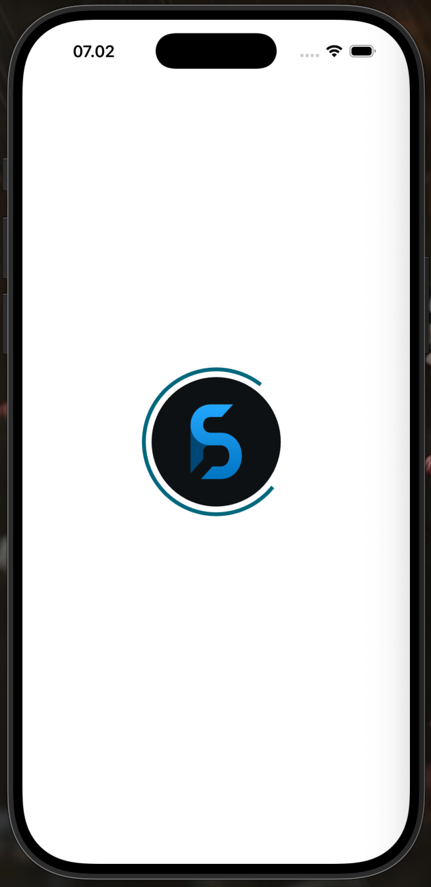
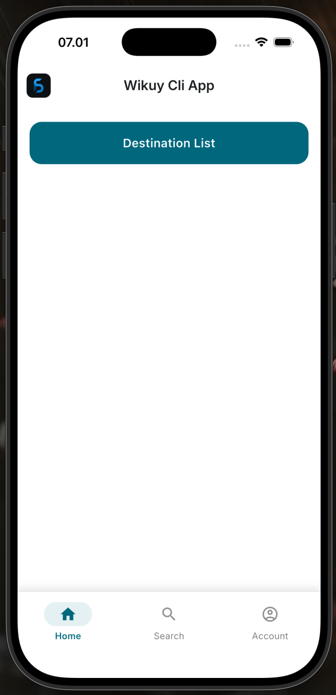
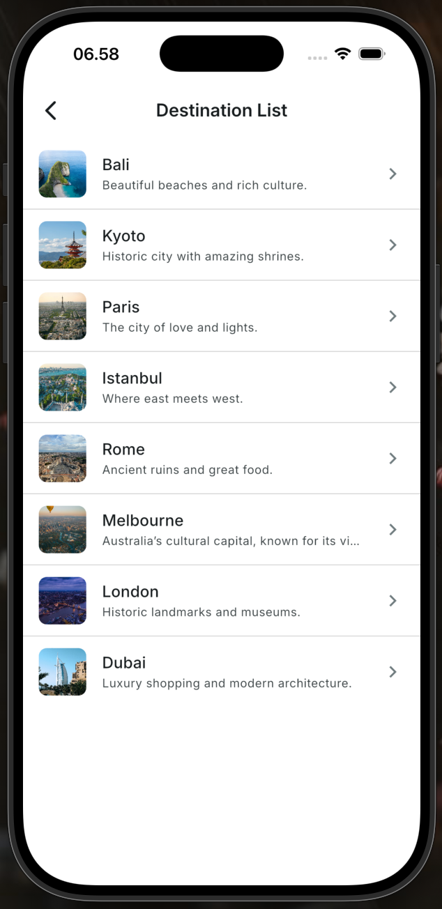

# Getting Started CLI-Driven E2E (Mayoritas CLI) - Wikuy

Dokumen ini memandu pembuatan project FSDA end-to-end dengan mayoritas proses melalui FSDA CLI, lalu finalisasi manual seperlunya.

## Target Hasil

- Workspace: `Wikuy`
- App: `wikuy`
- Module: `travel`
- Feature: `destination`
- Slice: `list`
- Sequence: `R`
- UI: `lsv`
- Compose target page: `destination_list_page`
- Main page class hasil compose: `DestinationListPage`
- API source: `GET /destinations`

## Prasyarat

- Flutter SDK dan Dart SDK terpasang
- `fsda` command tersedia di terminal

Jika memakai source lokal repo ini:

```bash
cd fsda_cli
dart pub global activate --source path .
```

## 1) Buat Workspace

Jalankan di luar workspace:

```bash
fsda create Wikuy
cd Wikuy
```

## 2) Setup Foundation Workspace

```bash
fsda configure
fsda add-pckg infra_dio
fsda add-pckg infra_logging
```

`infra_logging` opsional, tapi biasanya dipakai untuk tracing awal.

## 3) Generate App

```bash
fsda gen-app wikuy
fsda configure-app wikuy
```

Opsional finalisasi app branding/icon:

```bash
cd apps/wikuy
dart run package_rename
dart run flutter_launcher_icons
cd ../../
```

## 4) Generate Module, Feature, Slice

```bash
fsda gen-module travel
fsda gen-feature destination -m travel --ds remote
fsda gen-slice list -f destination -m travel -s R -d getDestinationList -u lsv
```

Penjelasan:

- `--ds remote`: karena data source dari public API
- `-s R`: retrieval sequence
- `-u lsv`: vertical list UI bundle

## 5) Register Module dan Install Feature DI

```bash
fsda reg travel -a wikuy
fsda di destination -m travel -a wikuy
```

## 6) Compose Main Page

```bash
fsda compose-main list -f destination -m travel -a wikuy -p destination_list_page
```

Hasil compose utama:

- generate page app wrapper `DestinationListPage`
- inject provider cubit retrieval
- auto bootstrap method retrieval di provider create
- update route module app wrapper

## 7) Finalisasi Manual (Bagian Kecil tapi Penting)

Setelah semua baseline tergenerate, lakukan manual finalisasi berikut:

1. Pastikan remote datasource menuju endpoint publik:
   - URL docs: `https://fdelux-mock-545621765686.asia-southeast2.run.app/docs/api/v1/#/Destinations`
   - endpoint runtime: `GET https://fdelux-mock-545621765686.asia-southeast2.run.app/api/v1/destinations`

   ::: code-group
   ```dart [core_di.dart]
   baseUrl: FDeluxMockConfig.cloudRunBaseUrl,
   ```
   :::

2. Sesuaikan path dan parsing response di datasource/repository jika bentuk payload API berubah.

   ::: code-group
   ```dart [destination_remote_data_source_impl.dart]
   final response = await _apiClient.get<Map<String, dynamic>>(
      '/destinations',
   );
   ```
   :::

3. Rapikan UX list item (title/subtitle, empty, error, skeleton) pada widget UI generated.

   ::: code-group
   ```dart [destination_list_item.dart]
   return AppListTile(
      leading: AppNetworkImage(
        url: destination.imageUrl,
        width: 48,
        height: 48,
        borderRadius: BorderRadius.circular(8),
      ),
      title: destination.name,
      subtitle: destination.description,
      includeChevron: true,
      onTap: onTap,
   );
   ```
   :::

4. Pastikan home/dashboard app memanggil route `DestinationListPage`. Bisa dengan buat navigasi dari home ke destination list atau jadikan destination list sebagai home nya.

   ::: code-group
   ```dart [home_page.dart]
   FilledButton(
      onPressed: () {
         TravelRoute.toDestinationList(context);
      },
      child: const Text('Destination List'),
   ),
   ```
   :::

5. Rapikan import ordering dan warning analyzer yang tidak memengaruhi behavior.

   ```bash
   fsda fix-import -m travel -a wikuy_cli_app
   ```

## 8) Validasi

```bash
cd apps/wikuy
flutter pub get
flutter run
```

Quality gate:

```bash
dart analyze
```

## 9) Result Screenshots

| Startup | Home Page | Destination List |
|:---------:|:---------:|:------------------:|
|  |  |  |

## One Shot Command

```bash
fsda create Wikuy-CLI && \
cd Wikuy-CLI && \
fsda configure && \
fsda add-pckg infra_dio && \
fsda add-pckg infra_logging && \
fsda gen-app wikuy_cli_app && \
fsda configure-app wikuy_cli_app && \
cd apps/wikuy_cli_app && \
dart run package_rename && \
dart run flutter_launcher_icons && \
cd ../../ && \
fsda gen-module travel && \
fsda gen-feature destination -m travel --ds remote && \
fsda gen-slice list -f destination -m travel -s R -d getDestinationList -u lsv && \
fsda reg travel -a wikuy_cli_app && \
fsda di destination -m travel -a wikuy_cli_app && \
fsda compose-main list -f destination -m travel -a wikuy_cli_app -p destination_list_page
```

## Ringkasan Jalur Ini

- Proses arsitektural utama diselesaikan oleh FSDA CLI.
- Manual work difokuskan untuk finalisasi API integration, UX polish, dan cleanup.
- Jalur ini paling cepat untuk bootstrapping project baru yang tetap patuh FSDA.