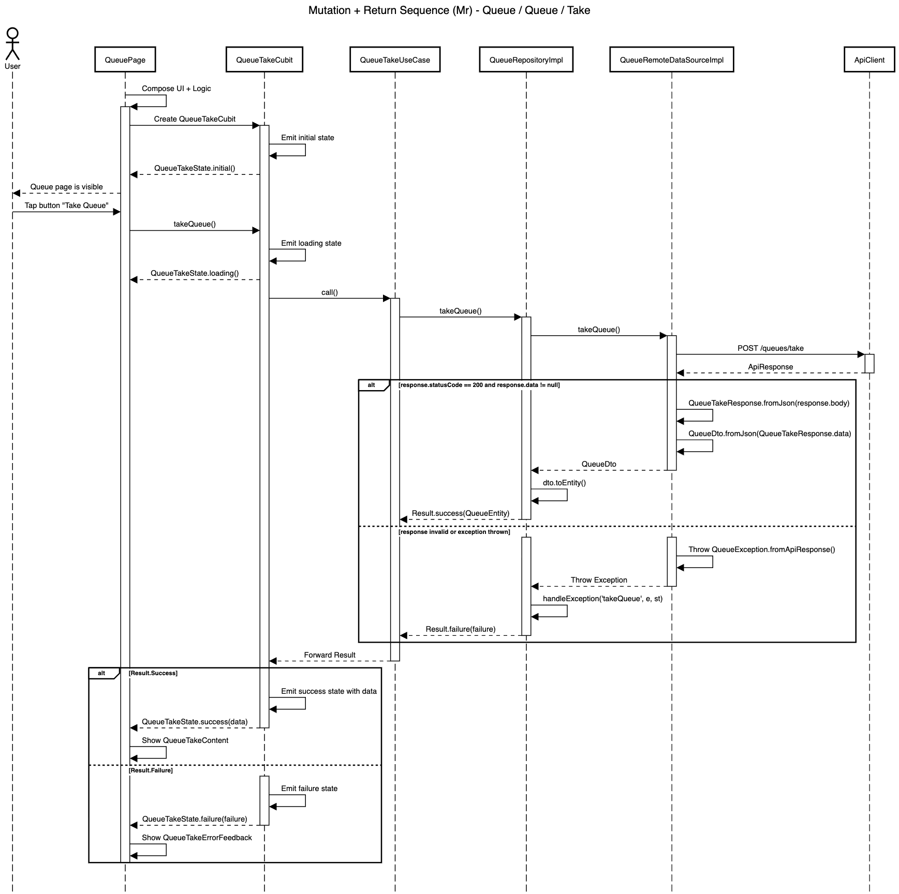

# Mutation + Return Blueprint

| Code | Sequence                      | Module       | Feature     | Feature Slice | Example Method           |
| ---- | ----------------------------- | ------------ | ----------- | ------------- | ------------------------ |
| Mr   | Mutation + Return             | queue        | queue       | take          | takeQueue()              |



## **Layer: Data**

### **Converters**

_modules/queue/lib/src/features/queue/data/converters/queue_status_converter.dart_

```dart
class QueueStatusConverter extends JsonConverter<QueueStatus, String> {
  const QueueStatusConverter();

  @override
  QueueStatus fromJson(String json) {
    return switch (json) {
      'waiting' => QueueStatus.waiting,
      'called' => QueueStatus.called,
      'done' => QueueStatus.done,
      _ => QueueStatus.waiting,
    };
  }

  @override
  String toJson(QueueStatus object) {
    return switch (object) {
      QueueStatus.waiting => 'waiting',
      QueueStatus.called => 'called',
      QueueStatus.done => 'done',
    };
  }
}
```

&nbsp;

### **Datasources**

_modules/queue/lib/src/features/queue/data/datasources/queue_remote_data_source_impl.dart_

```dart
class QueueRemoteDataSourceImpl implements QueueRemoteDataSource {
  final ApiClient _apiClient;

  const QueueRemoteDataSourceImpl({required ApiClient apiClient})
    : _apiClient = apiClient;

  @override
  Future<QueueDto> takeQueue() async {
    final response = await _apiClient.post<Map<String, dynamic>>(
      '/queues/take',
    );

    if (response.statusCode == 200) {
      final queueTakeResponse = QueueTakeResponse.fromJson(response.body);
      if (queueTakeResponse.data != null) {
        return queueTakeResponse.data!;
      }
      throw const CoreException.serverError();
    }

    throw QueueException.fromApiResponse(response);
  }
}
```

&nbsp;

_modules/queue/lib/src/features/queue/data/datasources/queue_remote_data_source.dart_

```dart
abstract interface class QueueRemoteDataSource {
  Future<QueueDto> takeQueue();
}
```

&nbsp;

### **Dtos**

_modules/queue/lib/src/features/queue/data/dtos/queue_dto.dart_

```dart
@freezed
abstract class QueueDto with _$QueueDto {
  const QueueDto._();

  const factory QueueDto({
    required int id,
    required String queueNumber,
    @QueueStatusConverter() required QueueStatus status,
    @UtcDateTimeConverter() required DateTime createdAt,
    @UtcDateTimeConverter() required DateTime updatedAt,
  }) = _QueueDto;

  factory QueueDto.fromJson(Map<String, dynamic> json) =>
      _$QueueDtoFromJson(json);

  QueueEntity toEntity() {
    return QueueEntity(id: id, queueNumber: queueNumber, status: status);
  }
}
```

&nbsp;

### **Repositories**

_modules/queue/lib/src/features/queue/data/repositories/queue_repository_impl.dart_

```dart
class QueueRepositoryImpl
    with RepositoryExceptionHandler
    implements QueueRepository {
  final QueueRemoteDataSource _remoteDataSource;
  final AppLogger _log;

  const QueueRepositoryImpl({
    required QueueRemoteDataSource queueRemoteDataSource,
    required AppLogger appLogger,
  }) : _remoteDataSource = queueRemoteDataSource,
       _log = appLogger;

  @override
  AppLogger get log => _log;

  @override
  AsyncResult<QueueEntity> takeQueue() async {
    try {
      final dto = await _remoteDataSource.takeQueue();
      final entity = dto.toEntity();
      return Result.success(entity);
    } catch (e, st) {
      return handleException('takeQueue', e, st);
    }
  }
}
```

&nbsp;

### **Responses**

_modules/queue/lib/src/features/queue/data/responses/queue_take_response.dart_

```dart
@freezed
abstract class QueueTakeResponse with _$QueueTakeResponse {
  const factory QueueTakeResponse({
    required String status,
    required String message,
    @JsonKey(fromJson: _queueFromJson) QueueDto? data,
    String? code,
    List<String>? errors,
  }) = _QueueTakeResponse;

  factory QueueTakeResponse.fromJson(Map<String, dynamic> json) =>
      _$QueueTakeResponseFromJson(json);
}

QueueDto? _queueFromJson(Object? json) {
  if (json is Map) {
    return QueueDto.fromJson(json as Map<String, dynamic>);
  }
  return null;
}
```

&nbsp;

## **Layer: Domain**

### **Entities**

_modules/queue/lib/src/features/queue/domain/entities/queue_entity.dart_

```dart
@freezed
abstract class QueueEntity with _$QueueEntity {
  const factory QueueEntity({
    required int id,
    required String queueNumber,
    required QueueStatus status,
  }) = _QueueEntity;
}
```

&nbsp;

### **Enums**

_modules/queue/lib/src/features/queue/domain/enums/queue_status.dart_

```dart
enum QueueStatus { waiting, called, done }
```

&nbsp;

### **Repositories**

_modules/queue/lib/src/features/queue/domain/repositories/queue_repository.dart_

```dart
abstract interface class QueueRepository {
  AsyncResult<QueueEntity> takeQueue();
}
```

&nbsp;

### **Usecases**

_modules/queue/lib/src/features/queue/domain/usecases/queue_take_use_case.dart_

```dart
class QueueTakeUseCase extends NoParamUseCase<QueueEntity> {
  final QueueRepository _repository;

  const QueueTakeUseCase({required QueueRepository queueRepository})
    : _repository = queueRepository;

  @override
  AsyncResult<QueueEntity> call() => _repository.takeQueue();
}
```

&nbsp;

## **Layer: Logic**

### **Take**

_modules/queue/lib/src/features/queue/logic/take/queue_take_cubit.dart_

```dart
class QueueTakeCubit extends Cubit<QueueTakeState> {
  final QueueTakeUseCase _useCase;

  QueueTakeCubit({required QueueTakeUseCase queueTakeUseCase})
    : _useCase = queueTakeUseCase,
      super(const QueueTakeState.initial());

  Future<void> takeQueue() async {
    emit(const QueueTakeState.loading());

    final result = await _useCase();

    emit(
      result.when(
        success: (data) => QueueTakeState.success(data: data),
        failure: (failure) => QueueTakeState.failure(failure: failure),
      ),
    );
  }
}
```

&nbsp;

_modules/queue/lib/src/features/queue/logic/take/queue_take_state.dart_

```dart
@freezed
sealed class QueueTakeState with _$QueueTakeState {
  const factory QueueTakeState.initial() = _Initial;
  const factory QueueTakeState.loading() = _Loading;
  const factory QueueTakeState.success({required QueueEntity data}) = _Success;
  const factory QueueTakeState.failure({required Failure failure}) = _Failure;
}
```

&nbsp;

## **Layer: Ui**

### **Shared**

_modules/queue/lib/src/features/queue/ui/shared/extensions/queue_status_x.dart_

```dart
extension QueueStatusX on QueueStatus {
  String localize(BuildContext context) {
    final l10n = context.l10n!;
    return switch (this) {
      QueueStatus.waiting => l10n.queueStatusWaiting,
      QueueStatus.called => l10n.queueStatusCalled,
      QueueStatus.done => l10n.queueStatusDone,
    };
  }

  Color get color {
    return switch (this) {
      QueueStatus.waiting => Colors.orange,
      QueueStatus.called => Colors.green,
      QueueStatus.done => Colors.grey,
    };
  }
}
```

&nbsp;

### **Take**

_modules/queue/lib/src/features/queue/ui/take/views/queue_take_view.dart_

```dart
class QueueTakeView extends StatelessWidget {
  final Widget content;
  final Widget button;
  const QueueTakeView({super.key, required this.content, required this.button});

  @override
  Widget build(BuildContext context) {
    final l10n = context.l10n!;
    return Scaffold(
      appBar: AppBar(title: Text(l10n.queueTakeTitle)),
      body: Center(
        child: Column(
          mainAxisSize: MainAxisSize.min,
          children: [content, AppGap.lg, button],
        ),
      ),
    );
  }
}
```

&nbsp;

_modules/queue/lib/src/features/queue/ui/take/widgets/queue_take_button.dart_

```dart
class QueueTakeButton extends StatelessWidget {
  final bool isLoading;
  final VoidCallback? onPressed;
  const QueueTakeButton({super.key, required this.isLoading, this.onPressed});

  @override
  Widget build(BuildContext context) {
    final l10n = context.l10n!;
    return FractionallySizedBox(
      widthFactor: 0.6,
      child: AppSubmitFilledButton(
        text: l10n.queueTakeAction,
        isLoading: isLoading,
        onPressed: isLoading ? null : onPressed,
      ),
    );
  }
}
```

&nbsp;

_modules/queue/lib/src/features/queue/ui/take/widgets/queue_take_content.dart_

```dart
class QueueTakeContent extends StatelessWidget {
  final QueueEntity queue;
  const QueueTakeContent({super.key, required this.queue});

  @override
  Widget build(BuildContext context) {
    final l10n = context.l10n!;
    final textTheme = Theme.of(context).textTheme;
    return Column(
      mainAxisSize: MainAxisSize.min,
      children: [
        Text(queue.queueNumber, style: textTheme.displayLarge),
        AppGap.md,
        Text('${l10n.queueStatusLabel}:', style: textTheme.bodyMedium),
        AppGap.sm,
        Container(
          padding: const EdgeInsets.symmetric(horizontal: 24, vertical: 6),
          decoration: BoxDecoration(
            color: queue.status.color.withValues(alpha: 0.1),
            borderRadius: BorderRadius.circular(AppRadius.button),
          ),
          child: Text(
            queue.status.localize(context),
            style: textTheme.titleMedium,
          ),
        ),
      ],
    );
  }
}
```

&nbsp;

_modules/queue/lib/src/features/queue/ui/take/widgets/queue_take_error_feedback.dart_

```dart
class QueueTakeErrorFeedback extends StatelessWidget {
  final String message;
  const QueueTakeErrorFeedback({super.key, required this.message});

  @override
  Widget build(BuildContext context) {
    final l10n = context.l10n!;
    return AppErrorFeedback(title: l10n.queueTakeErrorTitle, message: message);
  }
}
```

&nbsp;

_modules/queue/lib/src/features/queue/ui/take/widgets/queue_take_initial_feedback.dart_

```dart
class QueueTakeInitialFeedback extends StatelessWidget {
  const QueueTakeInitialFeedback({super.key});

  @override
  Widget build(BuildContext context) {
    final l10n = context.l10n!;
    final textTheme = Theme.of(context).textTheme;
    return Column(
      crossAxisAlignment: CrossAxisAlignment.center,
      children: [
        Text(
          l10n.queueTakeInitialTitle,
          style: textTheme.titleMedium,
          textAlign: TextAlign.center,
        ),
        AppGap.md,
        Text(
          l10n.queueTakeInitialMessage,
          style: textTheme.bodyMedium,
          textAlign: TextAlign.center,
        ),
      ],
    );
  }
}
```

&nbsp;

_modules/queue/lib/src/features/queue/ui/take/widgets/queue_take_skeleton.dart_

```dart
class QueueTakeSkeleton extends StatelessWidget {
  const QueueTakeSkeleton({super.key});

  @override
  Widget build(BuildContext context) {
    return const Column(
      mainAxisSize: MainAxisSize.min,
      children: [
        /// Skeleton for Queue Number
        AppShimmer(width: 140, height: 60, radius: 8),

        AppGap.lg,

        /// Skeleton for Status label
        AppShimmer(width: 60, height: 22, radius: 8),

        AppGap.sm,

        /// Skeleton for Status Container
        /// Adjusting size for padding (12, 6) + text height bodyMedium
        AppShimmer(width: 120, height: 28, radius: 8),
      ],
    );
  }
}
```

&nbsp;

## **Barrel Files**

_modules/queue/lib/src/features/queue/queue_feature.dart_

```dart
export 'data/converters/queue_status_converter.dart';
export 'data/datasources/queue_remote_data_source.dart';
export 'data/datasources/queue_remote_data_source_impl.dart';
export 'data/dtos/queue_dto.dart';
export 'data/repositories/queue_repository_impl.dart';
export 'data/responses/queue_take_response.dart';

export 'domain/entities/queue_entity.dart';
export 'domain/enums/queue_status.dart';
export 'domain/repositories/queue_repository.dart';
export 'domain/usecases/queue_take_use_case.dart';

export 'logic/take/queue_take_cubit.dart';
export 'logic/take/queue_take_state.dart';

export 'ui/shared/extensions/queue_status_x.dart';
export 'ui/take/views/queue_take_view.dart';
export 'ui/take/widgets/queue_take_button.dart';
export 'ui/take/widgets/queue_take_content.dart';
export 'ui/take/widgets/queue_take_error_feedback.dart';
export 'ui/take/widgets/queue_take_initial_feedback.dart';
export 'ui/take/widgets/queue_take_skeleton.dart';
```

&nbsp;

