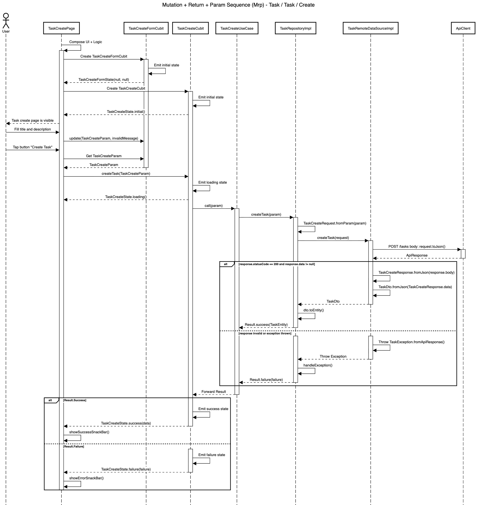

# Mutation + Return + Param Blueprint

| Code | Sequence                      | Module       | Feature     | Feature Slice | Example Method           |
| ---- | ----------------------------- | ------------ | ----------- | ------------- | ------------------------ |
| Mrp  | Mutation + Return + Param     | task         | task        | create        | createTask()             |



## **Layer: Data**

### **Converters**

_modules/task/lib/src/features/task/data/converters/task_status_converter.dart_

```dart
class TaskStatusConverter extends JsonConverter<TaskStatus, String> {
  const TaskStatusConverter();

  @override
  TaskStatus fromJson(String json) {
    return switch (json) {
      'todo' => TaskStatus.todo,
      'in_progress' => TaskStatus.inProgress,
      'completed' => TaskStatus.completed,
      _ => TaskStatus.todo,
    };
  }

  @override
  String toJson(TaskStatus object) {
    return switch (object) {
      TaskStatus.todo => 'todo',
      TaskStatus.inProgress => 'in_progress',
      TaskStatus.completed => 'completed',
    };
  }
}
```

&nbsp;

### **Datasources**

_modules/task/lib/src/features/task/data/datasources/task_remote_data_source_impl.dart_

```dart
class TaskRemoteDataSourceImpl implements TaskRemoteDataSource {
  final ApiClient _apiClient;

  const TaskRemoteDataSourceImpl({required ApiClient apiClient})
    : _apiClient = apiClient;

  @override
  Future<TaskDto> createTask(TaskCreateRequest request) async {
    final response = await _apiClient.post<Map<String, dynamic>>(
      '/tasks',
      body: request.toJson(),
    );
    if (response.statusCode == 200) {
      final taskCreateResponse = TaskCreateResponse.fromJson(response.body);
      if (taskCreateResponse.data != null) {
        return taskCreateResponse.data!;
      }

      throw const CoreException.serverError();
    }

    throw TaskException.fromApiResponse(response, st: StackTrace.current);
  }
}
```

&nbsp;

_modules/task/lib/src/features/task/data/datasources/task_remote_data_source.dart_

```dart
abstract interface class TaskRemoteDataSource {
  Future<TaskDto> createTask(TaskCreateRequest request);
}
```

&nbsp;

### **Dtos**

_modules/task/lib/src/features/task/data/dtos/task_dto.dart_

```dart
@freezed
abstract class TaskDto with _$TaskDto {
  const TaskDto._();

  const factory TaskDto({
    required int id,
    required String title,
    required String description,
    @TaskStatusConverter() required TaskStatus status,
    required DateTime createdAt,
    required DateTime updatedAt,
  }) = _TaskDto;

  factory TaskDto.fromJson(Map<String, Object?> json) =>
      _$TaskDtoFromJson(json);

  TaskEntity toEntity() {
    return TaskEntity(
      id: id,
      createdAt: createdAt,
      updatedAt: updatedAt,
      title: title,
      description: description,
      status: status,
    );
  }
}
```

&nbsp;

### **Repositories**

_modules/task/lib/src/features/task/data/repositories/task_repository_impl.dart_

```dart
class TaskRepositoryImpl
    with RepositoryExceptionHandler
    implements TaskRepository {
  final TaskRemoteDataSource _remoteDataSource;
  final AppLogger _log;

  const TaskRepositoryImpl({
    required TaskRemoteDataSource taskRemoteDataSource,
    required AppLogger appLogger,
  }) : _remoteDataSource = taskRemoteDataSource,
       _log = appLogger;

  @override
  AppLogger get log => _log;

  @override
  AsyncResult<TaskEntity> createTask(TaskCreateParam param) async {
    try {
      final request = TaskCreateRequest.fromParam(param);
      final dto = await _remoteDataSource.createTask(request);
      return Result.success(dto.toEntity());
    } catch (e, st) {
      return handleException('createTask', e, st);
    }
  }
}
```

&nbsp;

### **Requests**

_modules/task/lib/src/features/task/data/requests/task_create_request.dart_

```dart
@freezed
abstract class TaskCreateRequest with _$TaskCreateRequest {
  const TaskCreateRequest._();

  const factory TaskCreateRequest({
    required String title,
    required String description,
  }) = _TaskCreateRequest;

  factory TaskCreateRequest.fromJson(Map<String, Object?> json) =>
      _$TaskCreateRequestFromJson(json);

  factory TaskCreateRequest.fromParam(TaskCreateParam param) {
    return TaskCreateRequest(
      title: param.title,
      description: param.description,
    );
  }
}
```

&nbsp;

### **Responses**

_modules/task/lib/src/features/task/data/responses/task_create_response.dart_

```dart
@freezed
abstract class TaskCreateResponse with _$TaskCreateResponse {
  const TaskCreateResponse._();

  const factory TaskCreateResponse({
    required String status,
    required String message,
    @JsonKey(fromJson: _taskFromJson) TaskDto? data,
    String? code,
    List<String>? errors,
  }) = _TaskCreateResponse;

  factory TaskCreateResponse.fromJson(Map<String, Object?> json) =>
      _$TaskCreateResponseFromJson(json);
}

TaskDto? _taskFromJson(Object? json) {
  if (json is Map) {
    return TaskDto.fromJson(json as Map<String, dynamic>);
  }
  return null;
}
```

&nbsp;

## **Layer: Domain**

### **Entities**

_modules/task/lib/src/features/task/domain/entities/task_entity.dart_

```dart
@freezed
abstract class TaskEntity with _$TaskEntity {
  const factory TaskEntity({
    required int id,
    required String title,
    required String description,
    required TaskStatus status,
    required DateTime createdAt,
    required DateTime updatedAt,
  }) = _TaskEntity;
}
```

&nbsp;

### **Enums**

_modules/task/lib/src/features/task/domain/enums/task_status.dart_

```dart
enum TaskStatus { todo, inProgress, completed }
```

&nbsp;

### **Params**

_modules/task/lib/src/features/task/domain/params/task_create_param.dart_

```dart
@freezed
abstract class TaskCreateParam with _$TaskCreateParam {
  const factory TaskCreateParam({
    required String title,
    required String description,
  }) = _TaskCreateParam;
}
```

&nbsp;

### **Repositories**

_modules/task/lib/src/features/task/domain/repositories/task_repository.dart_

```dart
abstract interface class TaskRepository {
  AsyncResult<TaskEntity> createTask(TaskCreateParam param);
}
```

&nbsp;

### **Usecases**

_modules/task/lib/src/features/task/domain/usecases/task_create_use_case.dart_

```dart
class TaskCreateUseCase extends UseCase<TaskEntity, TaskCreateParam> {
  final TaskRepository _repository;

  const TaskCreateUseCase({required TaskRepository taskRepository})
    : _repository = taskRepository;

  @override
  AsyncResult<TaskEntity> call(TaskCreateParam param) {
    return _repository.createTask(param);
  }
}
```

&nbsp;

## **Layer: Logic**

### **Create**

_modules/task/lib/src/features/task/logic/create/task_create_cubit.dart_

```dart
class TaskCreateCubit extends Cubit<TaskCreateState> {
  final TaskCreateUseCase _useCase;

  TaskCreateCubit({required TaskCreateUseCase taskCreateUseCase})
    : _useCase = taskCreateUseCase,
      super(const TaskCreateState.initial());

  Future<void> createTask(TaskCreateParam param) async {
    emit(const TaskCreateState.loading());

    final result = await _useCase(param);

    emit(
      result.when(
        success: (data) => TaskCreateState.success(data: data),
        failure: (failure) => TaskCreateState.failure(failure: failure),
      ),
    );
  }
}
```

&nbsp;

_modules/task/lib/src/features/task/logic/create/task_create_form_cubit.dart_

```dart
class TaskCreateFormCubit extends Cubit<TaskCreateFormState> {
  TaskCreateFormCubit() : super(const TaskCreateFormState());

  void update(TaskCreateParam? param, String? invalidMessage) {
    emit(state.copyWith(param: param, invalidMessage: invalidMessage));
  }
}
```

&nbsp;

_modules/task/lib/src/features/task/logic/create/task_create_form_state.dart_

```dart
@freezed
abstract class TaskCreateFormState with _$TaskCreateFormState {
  const factory TaskCreateFormState({
    TaskCreateParam? param,
    String? invalidMessage,
  }) = _TaskCreateFormState;
}
```

&nbsp;

_modules/task/lib/src/features/task/logic/create/task_create_state.dart_

```dart
@freezed
sealed class TaskCreateState with _$TaskCreateState {
  const factory TaskCreateState.initial() = _Initial;
  const factory TaskCreateState.loading() = _Loading;
  const factory TaskCreateState.success({required TaskEntity data}) = _Success;
  const factory TaskCreateState.failure({required Failure failure}) = _Failure;
}
```

&nbsp;

## **Layer: Ui**

### **Create**

_modules/task/lib/src/features/task/ui/create/views/task_create_view.dart_

```dart
class TaskCreateView extends StatelessWidget {
  /// Use `TaskCreateForm`
  final Widget form;

  /// Use `TaskCreateButton`
  final Widget submitButton;

  const TaskCreateView({
    super.key,
    required this.form,
    required this.submitButton,
  });

  @override
  Widget build(BuildContext context) {
    final l10n = context.l10n!;
    return Scaffold(
      appBar: AppBar(title: Text(l10n.taskCreateTitle)),
      body: form,
      bottomNavigationBar: AppBottomContainer(child: submitButton),
    );
  }
}
```

&nbsp;

_modules/task/lib/src/features/task/ui/create/widgets/task_create_button.dart_

```dart
class TaskCreateButton extends StatelessWidget {
  final bool isLoading;
  final VoidCallback? onPressed;
  const TaskCreateButton({super.key, required this.isLoading, this.onPressed});

  @override
  Widget build(BuildContext context) {
    final l10n = context.l10n!;
    return AppSubmitFilledButton(
      text: l10n.taskCreateAction,
      isLoading: isLoading,
      onPressed: isLoading ? null : onPressed,
    );
  }
}
```

&nbsp;

_modules/task/lib/src/features/task/ui/create/widgets/task_create_form.dart_

```dart
class TaskCreateForm extends StatefulWidget {
  final void Function(
    BuildContext context,
    TaskCreateParam? param,
    String? invalidMessage,
  )
  onListen;
  const TaskCreateForm({super.key, required this.onListen});

  @override
  State<TaskCreateForm> createState() => _TaskCreateFormState();
}

class _TaskCreateFormState extends State<TaskCreateForm> {
  late final TextEditingController _titleController;
  late final TextEditingController _descriptionController;

  void _onInputChanged() {
    final l10n = context.l10n!;

    final title = _titleController.text;
    if (title.isEmpty) {
      widget.onListen(context, null, l10n.taskFieldTitleInvalidEmpty);
      return;
    }

    final description = _descriptionController.text;
    if (description.isEmpty) {
      widget.onListen(context, null, l10n.taskFieldDescriptionInvalidEmpty);
      return;
    }

    final param = TaskCreateParam(title: title, description: description);
    widget.onListen(context, param, null);
  }

  @override
  void initState() {
    super.initState();
    _titleController = TextEditingController()..addListener(_onInputChanged);
    _descriptionController = TextEditingController()
      ..addListener(_onInputChanged);
  }

  @override
  void dispose() {
    _titleController
      ..removeListener(_onInputChanged)
      ..dispose();
    _descriptionController
      ..removeListener(_onInputChanged)
      ..dispose();
    super.dispose();
  }

  @override
  Widget build(BuildContext context) {
    return ListView(
      padding: const EdgeInsets.all(AppSpacing.screen),
      children: [
        TaskTitleField(controller: _titleController),
        AppGap.lg,
        TaskDescriptionField(controller: _descriptionController),
      ],
    );
  }
}
```

&nbsp;

### **Shared**

_modules/task/lib/src/features/task/ui/shared/widgets/task_description_field.dart_

```dart
class TaskDescriptionField extends StatelessWidget {
  final TextEditingController controller;
  const TaskDescriptionField({super.key, required this.controller});

  @override
  Widget build(BuildContext context) {
    final l10n = context.l10n!;
    return AppSection(
      header: AppSectionHeader(titleText: l10n.taskFieldDescriptionLabel),
      content: AppTextField(
        controller: controller,
        hintText: l10n.taskFieldDescriptionHint,
        minLines: 5,
        maxLines: 5,
        textInputAction: TextInputAction.newline,
      ),
    );
  }
}
```

&nbsp;

_modules/task/lib/src/features/task/ui/shared/widgets/task_title_field.dart_

```dart
class TaskTitleField extends StatelessWidget {
  final TextEditingController controller;
  const TaskTitleField({super.key, required this.controller});

  @override
  Widget build(BuildContext context) {
    final l10n = context.l10n!;
    return AppSection(
      header: AppSectionHeader(titleText: l10n.taskFieldTitleLabel),
      content: AppTextField(
        controller: controller,
        hintText: l10n.taskFieldTitleHint,
      ),
    );
  }
}
```

&nbsp;

## **Barrel Files**

_modules/task/lib/src/features/task/task_feature.dart_

```dart
export 'data/datasources/task_remote_data_source.dart';
export 'data/datasources/task_remote_data_source_impl.dart';
export 'data/repositories/task_repository_impl.dart';

export 'domain/params/task_create_param.dart';
export 'domain/repositories/task_repository.dart';
export 'domain/usecases/task_create_use_case.dart';

export 'logic/create/task_create_cubit.dart';
export 'logic/create/task_create_form_cubit.dart';
export 'logic/create/task_create_form_state.dart';
export 'logic/create/task_create_state.dart';

export 'ui/create/views/task_create_view.dart';
export 'ui/create/widgets/task_create_button.dart';
export 'ui/create/widgets/task_create_form.dart';
```

&nbsp;

