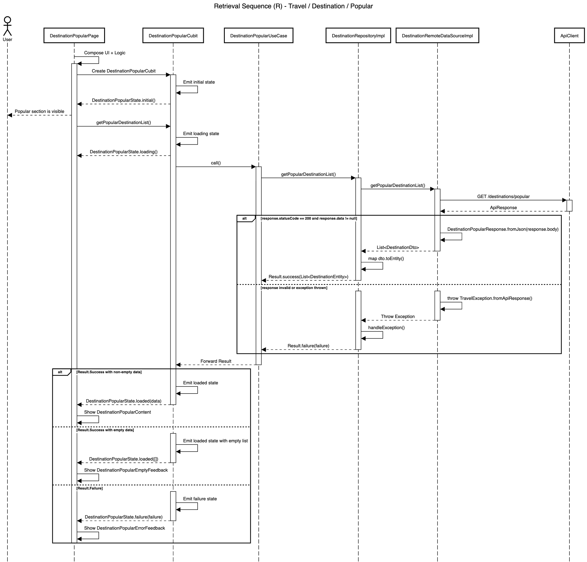

# Retrieval Blueprint

| Code | Sequence                      | Module       | Feature     | Feature Slice | Example Method           |
| ---- | ----------------------------- | ------------ | ----------- | ------------- | ------------------------ |
| R    | Retrieval                     | travel       | destination | popular       | getPopularDestination()  |



## **Layer: Data**

### **Datasources**

_modules/travel/lib/src/features/destination/data/datasources/destination_remote_data_source_impl.dart_

```dart
class DestinationRemoteDataSourceImpl implements DestinationRemoteDataSource {
  final ApiClient _apiClient;

  const DestinationRemoteDataSourceImpl({required ApiClient apiClient})
    : _apiClient = apiClient;

  @override
  Future<List<DestinationDto>> getPopularDestinationList() async {
    final response = await _apiClient.get<Map<String, dynamic>>(
      '/destinations/popular',
    );
    if (response.statusCode == 200) {
      final destinationPopularResponse = DestinationPopularResponse.fromJson(
        response.body,
      );
      if (destinationPopularResponse.data != null) {
        return destinationPopularResponse.data!;
      }

      throw const CoreException.serverError();
    }

    throw TravelException.fromApiResponse(response, st: StackTrace.current);
  }
}
```

&nbsp;

_modules/travel/lib/src/features/destination/data/datasources/destination_remote_data_source.dart_

```dart
abstract interface class DestinationRemoteDataSource {
  Future<List<DestinationDto>> getPopularDestinationList();
}
```

&nbsp;

### **Dtos**

_modules/travel/lib/src/features/destination/data/dtos/destination_dto.dart_

```dart
@freezed
abstract class DestinationDto with _$DestinationDto {
  const DestinationDto._();

  const factory DestinationDto({
    required int id,
    required String name,
    required String description,
    required String imageUrl,
    required double rating,
    required int reviewCount,
    required bool isPopular,
    @UtcDateTimeConverter() required DateTime createdAt,
    @UtcDateTimeConverter() required DateTime updatedAt,
  }) = _DestinationDto;

  factory DestinationDto.fromJson(Map<String, Object?> json) =>
      _$DestinationDtoFromJson(json);

  DestinationEntity toEntity() {
    return DestinationEntity(
      id: id,
      name: name,
      description: description,
      imageUrl: imageUrl,
      rating: rating,
      reviewCount: reviewCount,
      isPopular: isPopular,
      createdAt: createdAt,
      updatedAt: updatedAt,
    );
  }
}
```

&nbsp;

### **Repositories**

_modules/travel/lib/src/features/destination/data/repositories/destination_repository_impl.dart_

```dart
class DestinationRepositoryImpl
    with RepositoryExceptionHandler
    implements DestinationRepository {
  final DestinationRemoteDataSource _remoteDataSource;
  final AppLogger _log;

  const DestinationRepositoryImpl({
    required DestinationRemoteDataSource destinationRemoteDataSource,
    required AppLogger appLogger,
  }) : _remoteDataSource = destinationRemoteDataSource,
       _log = appLogger;

  @override
  AppLogger get log => _log;

  @override
  AsyncResult<List<DestinationEntity>> getPopularDestinationList() async {
    try {
      final destinations = await _remoteDataSource.getPopularDestinationList();
      return Result.success(destinations.map((e) => e.toEntity()).toList());
    } catch (e, st) {
      return handleException('getPopularDestinationList', e, st);
    }
  }
}
```

&nbsp;

### **Responses**

_modules/travel/lib/src/features/destination/data/responses/destination_popular_response.dart_

```dart
@freezed
abstract class DestinationPopularResponse with _$DestinationPopularResponse {
  const factory DestinationPopularResponse({
    required String status,
    required String message,
    @JsonKey(fromJson: _destinationListFromJson) List<DestinationDto>? data,
    String? code,
    List<String>? errors,
  }) = _DestinationPopularResponse;

  factory DestinationPopularResponse.fromJson(Map<String, dynamic> json) =>
      _$DestinationPopularResponseFromJson(json);
}

List<DestinationDto>? _destinationListFromJson(Object? json) {
  if (json is List) {
    return json
        .map((item) => DestinationDto.fromJson(item as Map<String, dynamic>))
        .toList();
  }
  return null;
}
```

&nbsp;

## **Layer: Domain**

### **Entities**

_modules/travel/lib/src/features/destination/domain/entities/destination_entity.dart_

```dart
@freezed
abstract class DestinationEntity with _$DestinationEntity {
  const factory DestinationEntity({
    required int id,
    required String name,
    required String description,
    required String imageUrl,
    required double rating,
    required int reviewCount,
    required bool isPopular,
    required DateTime createdAt,
    required DateTime updatedAt,
  }) = _DestinationEntity;
}
```

&nbsp;

### **Repositories**

_modules/travel/lib/src/features/destination/domain/repositories/destination_repository.dart_

```dart
abstract interface class DestinationRepository {
  AsyncResult<List<DestinationEntity>> getPopularDestinationList();
}
```

&nbsp;

### **Usecases**

_modules/travel/lib/src/features/destination/domain/usecases/destination_popular_use_case.dart_

```dart
class DestinationPopularUseCase
    extends NoParamUseCase<List<DestinationEntity>> {
  final DestinationRepository _repository;

  const DestinationPopularUseCase({
    required DestinationRepository destinationRepository,
  }) : _repository = destinationRepository;

  @override
  AsyncResult<List<DestinationEntity>> call() =>
      _repository.getPopularDestinationList();
}
```

&nbsp;

## **Layer: Logic**

### **Popular**

_modules/travel/lib/src/features/destination/logic/popular/destination_popular_cubit.dart_

```dart
class DestinationPopularCubit extends Cubit<DestinationPopularState> {
  final DestinationPopularUseCase _useCase;

  DestinationPopularCubit({
    required DestinationPopularUseCase destinationPopularUseCase,
  }) : _useCase = destinationPopularUseCase,
       super(const DestinationPopularState.initial());

  Future<void> getPopularDestinationList() async {
    emit(const DestinationPopularState.loading());

    final result = await _useCase();

    emit(
      result.when(
        success: (data) => DestinationPopularState.loaded(data: data),
        failure: (failure) => DestinationPopularState.failure(failure: failure),
      ),
    );
  }
}
```

&nbsp;

_modules/travel/lib/src/features/destination/logic/popular/destination_popular_state.dart_

```dart
@freezed
sealed class DestinationPopularState with _$DestinationPopularState {
  const factory DestinationPopularState.initial() = _Initial;
  const factory DestinationPopularState.loading() = _Loading;
  const factory DestinationPopularState.loaded({
    required List<DestinationEntity> data,
  }) = _Loaded;
  const factory DestinationPopularState.failure({required Failure failure}) =
      _Failure;
}
```

&nbsp;

## **Layer: Ui**

### **Popular**

_modules/travel/lib/src/features/destination/ui/popular/widgets/destination_popular_content.dart_

```dart
class DestinationPopularContent extends StatelessWidget {
  static const height = 280.0;

  final List<DestinationEntity> destinations;
  final void Function(DestinationEntity destination) onItemTap;
  const DestinationPopularContent({
    super.key,
    required this.destinations,
    required this.onItemTap,
  });

  @override
  Widget build(BuildContext context) {
    return SizedBox(
      height: height,
      child: ListView.separated(
        padding: const EdgeInsets.symmetric(horizontal: AppSpacing.md),
        scrollDirection: Axis.horizontal,
        itemCount: destinations.length,
        separatorBuilder: (context, index) => AppGap.md,
        itemBuilder: (context, index) {
          final destination = destinations[index];
          return DestinationPopularItem(
            destination: destination,
            onTap: () => onItemTap(destination),
          );
        },
      ),
    );
  }
}
```

&nbsp;

_modules/travel/lib/src/features/destination/ui/popular/widgets/destination_popular_empty_feedback.dart_

```dart
class DestinationPopularEmptyFeedback extends StatelessWidget {
  final VoidCallback onRefresh;
  const DestinationPopularEmptyFeedback({super.key, required this.onRefresh});

  @override
  Widget build(BuildContext context) {
    final l10n = context.l10n!;
    return AppErrorFeedback(
      title: l10n.destinationPopularEmptyTitle,
      message: l10n.destinationPopularEmptyMessage,
      retryText: l10n.refresh,
      onRetry: onRefresh,
    );
  }
}
```

&nbsp;

_modules/travel/lib/src/features/destination/ui/popular/widgets/destination_popular_error_feedback.dart_

```dart
class DestinationPopularErrorFeedback extends StatelessWidget {
  final String message;
  final VoidCallback onRetry;
  const DestinationPopularErrorFeedback({
    super.key,
    required this.message,
    required this.onRetry,
  });

  @override
  Widget build(BuildContext context) {
    final l10n = context.l10n!;
    return AppErrorFeedback(
      title: l10n.destinationPopularErrorTitle,
      message: message,
      retryText: l10n.retry,
      onRetry: onRetry,
    );
  }
}
```

&nbsp;

_modules/travel/lib/src/features/destination/ui/popular/widgets/destination_popular_section.dart_

```dart
class DestinationPopularSection extends StatelessWidget {
  final Widget content;
  final VoidCallback? onSeeAllPressed;
  const DestinationPopularSection({
    super.key,
    required this.content,
    this.onSeeAllPressed,
  });

  @override
  Widget build(BuildContext context) {
    final l10n = context.l10n!;
    return AppSection(
      header: Padding(
        padding: const EdgeInsets.symmetric(horizontal: AppSpacing.screen),
        child: AppSectionHeader(
          titleText: l10n.destinationPopularTitle,
          actionText: l10n.seeAll,
          onActionPressed: onSeeAllPressed,
        ),
      ),
      content: content,
    );
  }
}
```

&nbsp;

_modules/travel/lib/src/features/destination/ui/popular/widgets/destination_popular_skeleton.dart_

```dart
class DestinationPopularSkeleton extends StatelessWidget {
  final int itemCount;
  const DestinationPopularSkeleton({super.key, this.itemCount = 4});

  @override
  Widget build(BuildContext context) {
    return SizedBox(
      height: DestinationPopularContent.height,
      child: ListView.separated(
        padding: const EdgeInsets.symmetric(horizontal: AppSpacing.md),
        scrollDirection: Axis.horizontal,
        itemCount: itemCount,
        separatorBuilder: (context, index) => AppGap.md,
        itemBuilder: (context, index) {
          return const DestinationPopularItemSkeleton();
        },
      ),
    );
  }
}
```

&nbsp;

_modules/travel/lib/src/features/destination/ui/popular/widgets/parts/destination_popular_item_skeleton.dart_

```dart
class DestinationPopularItemSkeleton extends StatelessWidget {
  const DestinationPopularItemSkeleton({super.key});

  @override
  Widget build(BuildContext context) {
    final colorScheme = Theme.of(context).colorScheme;

    return AspectRatio(
      aspectRatio: DestinationPopularItem.aspectRatio,
      child: Container(
        decoration: BoxDecoration(
          color: colorScheme.surfaceContainer,
          borderRadius: const BorderRadius.all(Radius.circular(16)),
        ),
        child: const Stack(
          fit: StackFit.expand,
          children: [
            Positioned(
              left: AppSpacing.md,
              right: AppSpacing.md,
              bottom: AppSpacing.md,
              child: Column(
                crossAxisAlignment: CrossAxisAlignment.start,
                mainAxisSize: MainAxisSize.min,
                children: [
                  // Skeleton for destination name (titleMedium)
                  AppShimmer(width: 120, height: 18, radius: 4),

                  // Provide a small gap specifically for the skeleton to avoid sticking
                  SizedBox(height: 6),

                  Row(
                    children: [
                      // Skeleton for RatingBar (itemSize: 10)
                      // We make it elongated as if covering 5 stars
                      AppShimmer(width: 55, height: 10, radius: 2),

                      AppGap.sm,

                      // Skeleton for Review Count text (labelSmall)
                      AppShimmer(width: 35, height: 10, radius: 2),
                    ],
                  ),
                ],
              ),
            ),
          ],
        ),
      ),
    );
  }
}
```

&nbsp;

_modules/travel/lib/src/features/destination/ui/popular/widgets/parts/destination_popular_item.dart_

```dart
class DestinationPopularItem extends StatelessWidget {
  static const aspectRatio = 10 / 16;
  static const borderRadius = BorderRadius.all(Radius.circular(16));

  final DestinationEntity destination;
  final VoidCallback onTap;
  const DestinationPopularItem({
    super.key,
    required this.destination,
    required this.onTap,
  });

  @override
  Widget build(BuildContext context) {
    final textTheme = Theme.of(context).textTheme;
    return AspectRatio(
      aspectRatio: aspectRatio,
      child: GestureDetector(
        onTap: onTap,
        child: Stack(
          clipBehavior: Clip.antiAlias,
          fit: StackFit.expand,
          alignment: Alignment.bottomLeft,
          children: [
            AppNetworkImage(
              url: destination.imageUrl,
              fit: BoxFit.cover,
              borderRadius: borderRadius,
            ),
            DecoratedBox(
              decoration: BoxDecoration(
                borderRadius: DestinationPopularItem.borderRadius,
                gradient: LinearGradient(
                  begin: Alignment.topCenter,
                  end: Alignment.bottomCenter,
                  stops: [0.5, 1],
                  colors: [
                    Colors.transparent,
                    Colors.black.withValues(alpha: 0.9),
                  ],
                ),
              ),
            ),
            Positioned(
              left: AppSpacing.md,
              right: AppSpacing.md,
              bottom: AppSpacing.md,
              child: Column(
                crossAxisAlignment: CrossAxisAlignment.start,
                mainAxisSize: MainAxisSize.min,
                children: [
                  Text(
                    destination.name,
                    style: textTheme.titleMedium?.copyWith(color: Colors.white),
                  ),
                  AppGap.xs,
                  Row(
                    children: [
                      RatingBar.builder(
                        initialRating: destination.rating,
                        itemBuilder: (context, index) =>
                            const Icon(Icons.star_rounded, color: Colors.amber),
                        onRatingUpdate: (value) {},
                        allowHalfRating: true,
                        ignoreGestures: true,
                        itemSize: 12,
                        itemPadding: EdgeInsets.zero,
                      ),
                      AppGap.xs,
                      Text(
                        '(${NumberFormat.compact().format(destination.reviewCount)})',
                        style: const TextStyle(
                          fontSize: 10,
                          color: Colors.white70,
                        ),
                      ),
                    ],
                  ),
                ],
              ),
            ),
          ],
        ),
      ),
    );
  }
}
```

&nbsp;

## **Barrel Files**

_modules/travel/lib/src/features/destination/destination_feature.dart_

```dart
export 'data/datasources/destination_remote_data_source.dart';
export 'data/datasources/destination_remote_data_source_impl.dart';
export 'data/repositories/destination_repository_impl.dart';
export 'domain/entities/destination_entity.dart';
export 'domain/repositories/destination_repository.dart';
export 'domain/usecases/destination_popular_use_case.dart';
export 'logic/popular/destination_popular_cubit.dart';
export 'logic/popular/destination_popular_state.dart';
export 'ui/popular/widgets/destination_popular_content.dart';
export 'ui/popular/widgets/destination_popular_empty_feedback.dart';
export 'ui/popular/widgets/destination_popular_error_feedback.dart';
export 'ui/popular/widgets/destination_popular_section.dart';
export 'ui/popular/widgets/destination_popular_skeleton.dart';
export 'ui/popular/widgets/parts/destination_popular_item.dart';
```

&nbsp;

