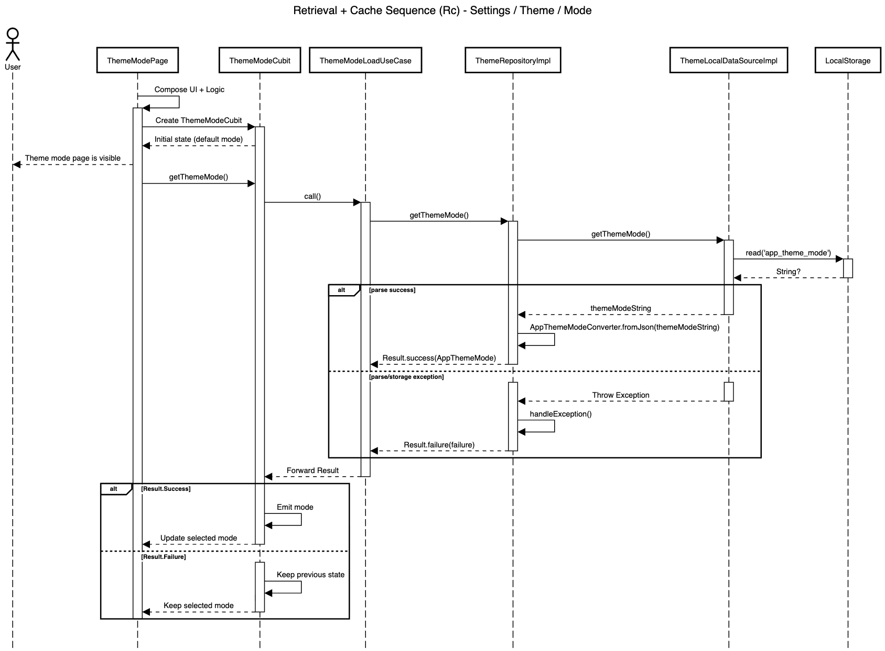

# Retrieval + Cache Blueprint

| Code | Sequence                      | Module       | Feature     | Feature Slice | Example Method           |
| ---- | ----------------------------- | ------------ | ----------- | ------------- | ------------------------ |
| Rc   | Retrieval + Cache             | settings     | theme       | mode          | getThemeMode()           |



## **Layer: Data**

### **Converters**

_modules/settings/lib/src/features/theme/data/converters/app_theme_mode_converter.dart_

```dart
class AppThemeModeConverter extends JsonConverter<AppThemeMode, String> {
  const AppThemeModeConverter();

  @override
  AppThemeMode fromJson(String? json) {
    return switch (json) {
      'system' => AppThemeMode.system,
      'light' => AppThemeMode.light,
      'dark' => AppThemeMode.dark,
      _ => AppThemeMode.system,
    };
  }

  @override
  String toJson(AppThemeMode object) {
    return switch (object) {
      AppThemeMode.system => 'system',
      AppThemeMode.light => 'light',
      AppThemeMode.dark => 'dark',
    };
  }
}
```

&nbsp;

### **Datasources**

_modules/settings/lib/src/features/theme/data/datasources/theme_local_data_source_impl.dart_

```dart
class ThemeLocalDataSourceImpl implements ThemeLocalDataSource {
  static const _themeModeKey = 'app_theme_mode';

  final LocalStorage _storage;

  const ThemeLocalDataSourceImpl({required LocalStorage localStorage})
    : _storage = localStorage;

  @override
  String getThemeMode() {
    final themeModeStr = _storage.read(_themeModeKey) as String?;
    return themeModeStr ?? '';
  }
}
```

&nbsp;

_modules/settings/lib/src/features/theme/data/datasources/theme_local_data_source.dart_

```dart
abstract interface class ThemeLocalDataSource {
  String getThemeMode();
}
```

&nbsp;

### **Repositories**

_modules/settings/lib/src/features/theme/data/repositories/theme_repository_impl.dart_

```dart
class ThemeRepositoryImpl
    with RepositoryExceptionHandler
    implements ThemeRepository {
  final ThemeLocalDataSource _remoteDataSource;
  final AppLogger _log;

  const ThemeRepositoryImpl({
    required ThemeLocalDataSource themeRemoteDataSource,
    required AppLogger appLogger,
  }) : _remoteDataSource = themeRemoteDataSource,
       _log = appLogger;

  @override
  AppLogger get log => _log;

  @override
  Result<AppThemeMode> getThemeMode() {
    try {
      final themeMode = _remoteDataSource.getThemeMode();
      final appThemeMode = const AppThemeModeConverter().fromJson(themeMode);
      return Result.success(appThemeMode);
    } catch (e, st) {
      return handleException('getThemeMode', e, st);
    }
  }
}
```

&nbsp;

## **Layer: Domain**

### **Enums**

_modules/settings/lib/src/features/theme/domain/enums/app_theme_mode.dart_

```dart
enum AppThemeMode { system, light, dark }
```

&nbsp;

### **Repositories**

_modules/settings/lib/src/features/theme/domain/repositories/theme_repository.dart_

```dart
abstract interface class ThemeRepository {
  Result<AppThemeMode> getThemeMode();
}
```

&nbsp;

### **Usecases**

_modules/settings/lib/src/features/theme/domain/usecases/theme_mode_load_use_case.dart_

```dart
class ThemeModeLoadUseCase extends NoParamSyncUseCase<AppThemeMode> {
  final ThemeRepository _repository;

  const ThemeModeLoadUseCase({required ThemeRepository themeRepository})
    : _repository = themeRepository;

  @override
  Result<AppThemeMode> call() {
    return _repository.getThemeMode();
  }
}
```

&nbsp;

## **Layer: Logic**

### **Mode**

_modules/settings/lib/src/features/theme/logic/mode/theme_mode_cubit.dart_

```dart
class ThemeModeCubit extends Cubit<AppThemeMode> {
  final ThemeModeLoadUseCase _useCase;

  ThemeModeCubit({required ThemeModeLoadUseCase themeModeLoadUseCase})
    : _useCase = themeModeLoadUseCase,
      super(AppThemeMode.light);

  void getThemeMode() {
    final result = _useCase();
    emit(result.when(success: (mode) => mode, failure: (error) => state));
  }
}
```

&nbsp;

## **Layer: Ui**

### **Mode**

_modules/settings/lib/src/features/theme/ui/mode/views/theme_mode_view.dart_

```dart
class ThemeModeView extends StatelessWidget {
  final Widget content;
  const ThemeModeView({super.key, required this.content});

  @override
  Widget build(BuildContext context) {
    final l10n = context.l10n!;
    return Scaffold(
      appBar: AppBar(title: Text(l10n.themeModeTitle)),
      body: content,
    );
  }
}
```

&nbsp;

_modules/settings/lib/src/features/theme/ui/mode/widgets/theme_mode_content.dart_

```dart
class ThemeModeContent extends StatelessWidget {
  final AppThemeMode selectedMode;
  final void Function(AppThemeMode mode) onModeSelected;
  const ThemeModeContent({
    super.key,
    required this.selectedMode,
    required this.onModeSelected,
  });

  @override
  Widget build(BuildContext context) {
    return ListView(
      padding: const EdgeInsets.all(AppSpacing.screen),
      children: [
        AppCard(
          children: AppThemeMode.values
              .map(
                (e) => AppOptionTile(
                  title: e.localize(context),
                  isSelected: e == selectedMode,
                  leadingIcon: Icon(e.icon),
                  onTap: () => onModeSelected(e),
                ),
              )
              .toList(),
        ),
      ],
    );
  }
}
```

&nbsp;

### **Shared**

_modules/settings/lib/src/features/theme/ui/shared/extensions/app_theme_mode_x.dart_

```dart
extension AppThemeModeX on AppThemeMode {
  String localize(BuildContext context) {
    final l10n = context.l10n!;

    return switch (this) {
      AppThemeMode.system => l10n.themeModeSystem,
      AppThemeMode.light => l10n.themeModeLight,
      AppThemeMode.dark => l10n.themeModeDark,
    };
  }

  IconData get icon {
    return switch (this) {
      AppThemeMode.system => Icons.phone_iphone,
      AppThemeMode.light => Icons.light_mode,
      AppThemeMode.dark => Icons.dark_mode,
    };
  }
}
```

&nbsp;

## **Barrel Files**

_modules/settings/lib/src/features/theme/theme_feature.dart_

```dart
export 'data/datasources/theme_local_data_source.dart';
export 'data/datasources/theme_local_data_source_impl.dart';
export 'data/repositories/theme_repository_impl.dart';
export 'domain/enums/app_theme_mode.dart';
export 'domain/repositories/theme_repository.dart';
export 'domain/usecases/theme_mode_load_use_case.dart';
export 'logic/mode/theme_mode_cubit.dart';
export 'ui/mode/views/theme_mode_view.dart';
export 'ui/mode/widgets/theme_mode_content.dart';
```

&nbsp;

