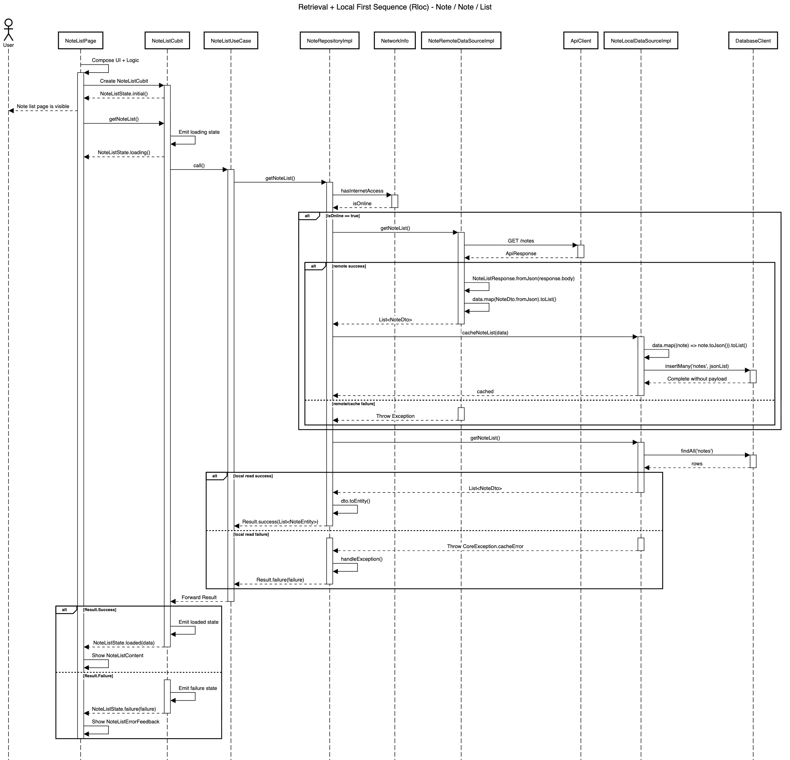

# Retrieval + Local First Blueprint

| Code | Sequence                      | Module       | Feature     | Feature Slice | Example Method           |
| ---- | ----------------------------- | ------------ | ----------- | ------------- | ------------------------ |
| Rloc | Retrieval + Local First       | note         | note        | list          | getNoteList()            |



## **Layer: Data**

### **Datasources**

_modules/note/lib/src/features/note/data/datasources/local/note_local_data_source_impl.dart_

```dart
class NoteLocalDataSourceImpl implements NoteLocalDataSource {
  final DatabaseClient _client;

  const NoteLocalDataSourceImpl({required DatabaseClient databaseClient})
    : _client = databaseClient;

  @override
  Future<List<NoteDto>> getNoteList() async {
    try {
      final rows = await _client.findAll('notes');
      return rows.map((row) => NoteDto.fromJson(row)).toList();
    } catch (e, st) {
      throw CoreException.cacheError(
        msg: 'Failed to load notes from local cache: $e',
        st: st,
      );
    }
  }

  @override
  Future<void> cacheNoteList(List<NoteDto> data) async {
    try {
      await _client.insertMany(
        'notes',
        data.map((note) => note.toJson()).toList(),
      );
    } catch (e, st) {
      throw CoreException.cacheError(
        msg: 'Failed to cache notes to local storage: $e',
        st: st,
      );
    }
  }
}
```

&nbsp;

_modules/note/lib/src/features/note/data/datasources/local/note_local_data_source.dart_

```dart
abstract interface class NoteLocalDataSource {
  Future<List<NoteDto>> getNoteList();
  Future<void> cacheNoteList(List<NoteDto> data);
}
```

&nbsp;

_modules/note/lib/src/features/note/data/datasources/remote/note_remote_data_source_impl.dart_

```dart
class NoteRemoteDataSourceImpl implements NoteRemoteDataSource {
  final ApiClient _apiClient;

  const NoteRemoteDataSourceImpl({required ApiClient apiClient})
    : _apiClient = apiClient;

  @override
  Future<List<NoteDto>> getNoteList() async {
    final response = await _apiClient.get<Map<String, dynamic>>('/notes');
    if (response.statusCode == 200) {
      final noteListResponse = NoteListResponse.fromJson(response.body);
      if (noteListResponse.data != null) {
        return noteListResponse.data!;
      }
      throw const NoteException.noteNotFound();
    }

    throw NoteException.fromApiResponse(response);
  }
}
```

&nbsp;

_modules/note/lib/src/features/note/data/datasources/remote/note_remote_data_source.dart_

```dart
abstract interface class NoteRemoteDataSource {
  Future<List<NoteDto>> getNoteList();
}
```

&nbsp;

### **Dtos**

_modules/note/lib/src/features/note/data/dtos/note_dto.dart_

```dart
@freezed
abstract class NoteDto with _$NoteDto {
  const NoteDto._();

  const factory NoteDto({
    required int id,
    required String title,
    required String content,
    @UtcDateTimeConverter() required DateTime createdAt,
    @UtcDateTimeConverter() required DateTime updatedAt,
  }) = _NoteDto;

  factory NoteDto.fromJson(Map<String, Object?> json) =>
      _$NoteDtoFromJson(json);

  NoteEntity toEntity() {
    return NoteEntity(
      id: id,
      title: title,
      content: content,
      createdAt: createdAt,
      updatedAt: updatedAt,
    );
  }
}
```

&nbsp;

### **Repositories**

_modules/note/lib/src/features/note/data/repositories/note_repository_impl.dart_

```dart
class NoteRepositoryImpl
    with RepositoryExceptionHandler
    implements NoteRepository {
  final NoteLocalDataSource _localDataSource;
  final NoteRemoteDataSource _remoteDataSource;
  final NetworkInfo _networkInfo;
  final AppLogger _log;

  const NoteRepositoryImpl({
    required NoteLocalDataSource noteLocalDataSource,
    required NoteRemoteDataSource noteRemoteDataSource,
    required NetworkInfo networkInfo,
    required AppLogger appLogger,
  }) : _localDataSource = noteLocalDataSource,
       _remoteDataSource = noteRemoteDataSource,
       _networkInfo = networkInfo,
       _log = appLogger;

  @override
  AppLogger get log => _log;

  @override
  AsyncResult<List<NoteEntity>> getNoteList() async {
    final isOnline = await _networkInfo.hasInternetAccess;

    if (isOnline) {
      try {
        final noteDtos = await _remoteDataSource.getNoteList();
        await _localDataSource.cacheNoteList(noteDtos);
      } catch (e, st) {
        log.warning(
          'getNoteList refresh cache failed',
          error: e,
          stackTrace: st,
        );
      }
    }

    try {
      final cachedNotes = await _localDataSource.getNoteList();

      return Result.success(cachedNotes.map((dto) => dto.toEntity()).toList());
    } catch (e, st) {
      return handleException('getNoteList', e, st);
    }
  }
}
```

&nbsp;

### **Responses**

_modules/note/lib/src/features/note/data/responses/note_list_response.dart_

```dart
@freezed
abstract class NoteListResponse with _$NoteListResponse {
  const factory NoteListResponse({
    required String status,
    required String message,
    Map<String, dynamic>? meta,
    @JsonKey(fromJson: _noteListFromJson) List<NoteDto>? data,
    String? code,
    List<String>? errors,
  }) = _NoteListResponse;

  factory NoteListResponse.fromJson(Map<String, dynamic> json) =>
      _$NoteListResponseFromJson(json);
}

List<NoteDto>? _noteListFromJson(Object? json) {
  if (json is List) {
    return json
        .map((item) => NoteDto.fromJson(item as Map<String, dynamic>))
        .toList();
  }
  return null;
}
```

&nbsp;

## **Layer: Domain**

### **Entities**

_modules/note/lib/src/features/note/domain/entities/note_entity.dart_

```dart
@freezed
abstract class NoteEntity with _$NoteEntity {
  const factory NoteEntity({
    required int id,
    required String title,
    required String content,
    required DateTime createdAt,
    required DateTime updatedAt,
  }) = _NoteEntity;
}
```

&nbsp;

### **Repositories**

_modules/note/lib/src/features/note/domain/repositories/note_repository.dart_

```dart
abstract interface class NoteRepository {
  AsyncResult<List<NoteEntity>> getNoteList();
}
```

&nbsp;

### **Usecases**

_modules/note/lib/src/features/note/domain/usecases/note_list_use_case.dart_

```dart
class NoteListUseCase extends NoParamUseCase<List<NoteEntity>> {
  final NoteRepository _repository;

  const NoteListUseCase({required NoteRepository noteRepository})
    : _repository = noteRepository;

  @override
  AsyncResult<List<NoteEntity>> call() => _repository.getNoteList();
}
```

&nbsp;

## **Layer: Logic**

### **List**

_modules/note/lib/src/features/note/logic/list/note_list_cubit.dart_

```dart
class NoteListCubit extends Cubit<NoteListState> {
  final NoteListUseCase _useCase;

  NoteListCubit({required NoteListUseCase noteListUseCase})
    : _useCase = noteListUseCase,
      super(const NoteListState.initial());

  Future<void> getNotes() async {
    emit(const NoteListState.loading());

    final result = await _useCase();

    emit(
      result.when(
        success: (data) => NoteListState.loaded(data: data),
        failure: (failure) => NoteListState.failure(failure: failure),
      ),
    );
  }
}
```

&nbsp;

_modules/note/lib/src/features/note/logic/list/note_list_state.dart_

```dart
@freezed
sealed class NoteListState with _$NoteListState {
  const factory NoteListState.initial() = _Initial;
  const factory NoteListState.loading() = _Loading;
  const factory NoteListState.loaded({required List<NoteEntity> data}) =
      _Loaded;
  const factory NoteListState.failure({required Failure failure}) = _Failure;
}
```

&nbsp;

## **Layer: Ui**

### **List**

_modules/note/lib/src/features/note/ui/list/note_list_view.dart_

```dart
class NoteListView extends StatelessWidget {
  final Widget content;

  const NoteListView({super.key, required this.content});

  @override
  Widget build(BuildContext context) {
    final l10n = context.l10n!;
    return Scaffold(
      appBar: AppBar(title: Text(l10n.noteListTitle)),
      body: content,
    );
  }
}
```

&nbsp;

_modules/note/lib/src/features/note/ui/list/views/note_list_view.dart_

```dart
class NoteListView extends StatelessWidget {
  final Widget content;
  const NoteListView({super.key, required this.content});

  @override
  Widget build(BuildContext context) {
    final l10n = context.l10n!;
    return Scaffold(
      appBar: AppBar(title: Text(l10n.noteListTitle)),
      body: content,
    );
  }
}
```

&nbsp;

_modules/note/lib/src/features/note/ui/list/widgets/note_list_content.dart_

```dart
class NoteListContent extends StatelessWidget {
  final List<NoteEntity> notes;
  final void Function(NoteEntity item) onItemTap;
  const NoteListContent({
    super.key,
    required this.notes,
    required this.onItemTap,
  });

  @override
  Widget build(BuildContext context) {
    final padding = MediaQuery.paddingOf(context);
    return ListView.separated(
      padding: EdgeInsets.fromLTRB(
        AppSpacing.screen,
        AppSpacing.screen,
        AppSpacing.screen,
        AppSpacing.screen + padding.bottom,
      ),
      itemBuilder: (context, index) {
        final note = notes[index];
        return AppListTile(
          leading: AppLeadingIndex(number: index + 1),
          title: note.title,
          subtitle: note.content,
          includeChevron: true,
          onTap: () => onItemTap(note),
        );
      },
      separatorBuilder: (context, index) => const Divider(),
      itemCount: notes.length,
    );
  }
}
```

&nbsp;

_modules/note/lib/src/features/note/ui/list/widgets/note_list_empty_feedback.dart_

```dart
class NoteListEmptyFeedback extends StatelessWidget {
  final VoidCallback onRefresh;
  const NoteListEmptyFeedback({super.key, required this.onRefresh});

  @override
  Widget build(BuildContext context) {
    final l10n = context.l10n!;
    return AppEmptyFeedback(
      title: l10n.noteListEmptyTitle,
      message: l10n.noteListEmptyMessage,
      onRefresh: onRefresh,
      refreshText: l10n.refresh,
    );
  }
}
```

&nbsp;

_modules/note/lib/src/features/note/ui/list/widgets/note_list_error_feedback.dart_

```dart
class NoteListErrorFeedback extends StatelessWidget {
  final String message;
  final VoidCallback onRetry;
  const NoteListErrorFeedback({
    super.key,
    required this.message,
    required this.onRetry,
  });

  @override
  Widget build(BuildContext context) {
    final l10n = context.l10n!;
    return AppErrorFeedback(
      title: l10n.noteListErrorTitle,
      message: message,
      retryText: l10n.retry,
      onRetry: onRetry,
    );
  }
}
```

&nbsp;

_modules/note/lib/src/features/note/ui/list/widgets/note_list_skeleton.dart_

```dart
class NoteListSkeleton extends StatelessWidget {
  final int itemCount;
  const NoteListSkeleton({super.key, this.itemCount = 10});

  @override
  Widget build(BuildContext context) {
    final padding = MediaQuery.paddingOf(context);
    return ListView.separated(
      padding: EdgeInsets.fromLTRB(
        AppSpacing.screen,
        AppSpacing.screen,
        AppSpacing.screen,
        AppSpacing.screen + padding.bottom,
      ),
      itemBuilder: (context, index) {
        return const AppListTileSkeleton();
      },
      separatorBuilder: (context, index) => const Divider(),
      itemCount: itemCount,
    );
  }
}
```

&nbsp;

## **Barrel Files**

_modules/note/lib/src/features/note/note_feature.dart_

```dart
export 'data/datasources/local/note_local_data_source.dart';
export 'data/datasources/local/note_local_data_source_impl.dart';
export 'data/datasources/remote/note_remote_data_source.dart';
export 'data/datasources/remote/note_remote_data_source_impl.dart';
export 'data/repositories/note_repository_impl.dart';
export 'domain/entities/note_entity.dart';
export 'domain/repositories/note_repository.dart';
export 'domain/usecases/note_list_use_case.dart';
export 'logic/list/note_list_cubit.dart';
export 'logic/list/note_list_state.dart';
export 'ui/list/views/note_list_view.dart';
export 'ui/list/widgets/note_list_content.dart';
export 'ui/list/widgets/note_list_empty_feedback.dart';
export 'ui/list/widgets/note_list_error_feedback.dart';
export 'ui/list/widgets/note_list_skeleton.dart';
```

&nbsp;

