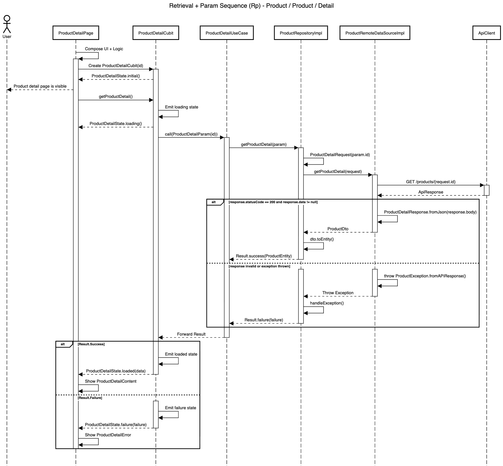

# Retrieval + Param Blueprint

| Code | Sequence                      | Module       | Feature     | Feature Slice | Example Method           |
| ---- | ----------------------------- | ------------ | ----------- | ------------- | ------------------------ |
| Rp   | Retrieval + Param             | product      | product     | detail        | getProductDetail()       |



## **Layer: Data**

### **Datasources**

_modules/product/lib/src/features/product/data/datasources/product_remote_data_source_impl.dart_

```dart
class ProductRemoteDataSourceImpl implements ProductRemoteDataSource {
  final ApiClient _apiClient;

  const ProductRemoteDataSourceImpl({required ApiClient apiClient})
    : _apiClient = apiClient;

  @override
  Future<ProductDto> getProductDetail(ProductDetailRequest request) async {
    final response = await _apiClient.get<Map<String, dynamic>>(
      '/products/${request.id}',
    );

    if (response.statusCode == 200) {
      final productDetailResponse = ProductDetailResponse.fromJson(
        response.body,
      );
      if (productDetailResponse.data != null) {
        return productDetailResponse.data!;
      }

      throw CoreException.serverError(
        msg: 'Product data is null',
        st: StackTrace.current,
      );
    }

    throw ProductException.fromStatusCode(
      response.statusCode,
      msg: response.body.toString(),
      st: StackTrace.current,
    );
  }
}
```

&nbsp;

_modules/product/lib/src/features/product/data/datasources/product_remote_data_source.dart_

```dart
abstract interface class ProductRemoteDataSource {
  Future<ProductDto> getProductDetail(ProductDetailRequest request);
}
```

&nbsp;

### **Dtos**

_modules/product/lib/src/features/product/data/dtos/product_dto.dart_

```dart
@freezed
abstract class ProductDto with _$ProductDto {
  const ProductDto._();

  const factory ProductDto({
    required int id,
    required String name,
    required double price,
    required String description,
    required int stock,
    required String imageUrl,
    @UtcDateTimeConverter() required DateTime createdAt,
    @UtcDateTimeConverter() required DateTime updatedAt,
  }) = _ProductDto;

  factory ProductDto.fromJson(Map<String, Object?> json) =>
      _$ProductDtoFromJson(json);

  ProductEntity toEntity() {
    return ProductEntity(
      id: id,
      name: name,
      price: price,
      description: description,
      stock: stock,
      imageUrl: imageUrl,
      createdAt: createdAt,
      updatedAt: updatedAt,
    );
  }
}
```

&nbsp;

### **Repositories**

_modules/product/lib/src/features/product/data/repositories/product_repository_impl.dart_

```dart
class ProductRepositoryImpl
    with RepositoryExceptionHandler
    implements ProductRepository {
  final ProductRemoteDataSource _remoteDataSource;
  final AppLogger _log;

  const ProductRepositoryImpl({
    required ProductRemoteDataSource productRemoteDataSource,
    required AppLogger appLogger,
  }) : _remoteDataSource = productRemoteDataSource,
       _log = appLogger;

  @override
  AppLogger get log => _log;

  @override
  AsyncResult<ProductEntity> getProductDetail(ProductDetailParam param) async {
    try {
      final request = ProductDetailRequest.fromParam(param);
      final productDto = await _remoteDataSource.getProductDetail(request);
      return Result.success(productDto.toEntity());
    } catch (e, st) {
      return handleException('getProduct', e, st);
    }
  }
}
```

&nbsp;

### **Requests**

_modules/product/lib/src/features/product/data/requests/product_detail_request.dart_

```dart
@freezed
abstract class ProductDetailRequest with _$ProductDetailRequest {
  const ProductDetailRequest._();

  const factory ProductDetailRequest({required int id}) = _ProductDetailRequest;

  factory ProductDetailRequest.fromJson(Map<String, Object?> json) =>
      _$ProductDetailRequestFromJson(json);

  factory ProductDetailRequest.fromParam(ProductDetailParam param) {
    return ProductDetailRequest(id: param.id);
  }
}
```

&nbsp;

### **Responses**

_modules/product/lib/src/features/product/data/responses/product_detail_response.dart_

```dart
@freezed
abstract class ProductDetailResponse with _$ProductDetailResponse {
  const ProductDetailResponse._();

  const factory ProductDetailResponse({
    required String status,
    required String message,
    @JsonKey(fromJson: _productFromJson) ProductDto? data,
    String? code,
    List<String>? errors,
  }) = _ProductDetailResponse;

  factory ProductDetailResponse.fromJson(Map<String, Object?> json) =>
      _$ProductDetailResponseFromJson(json);
}

ProductDto? _productFromJson(Object? json) {
  if (json is Map) {
    return ProductDto.fromJson(json as Map<String, dynamic>);
  }
  return null;
}
```

&nbsp;

## **Layer: Domain**

### **Entities**

_modules/product/lib/src/features/product/domain/entities/product_entity.dart_

```dart
@freezed
abstract class ProductEntity with _$ProductEntity {
  const factory ProductEntity({
    required int id,
    required String name,
    required double price,
    required String description,
    required int stock,
    required String imageUrl,
    required DateTime createdAt,
    required DateTime updatedAt,
  }) = _ProductEntity;
}
```

&nbsp;

### **Params**

_modules/product/lib/src/features/product/domain/params/product_detail_param.dart_

```dart
@freezed
abstract class ProductDetailParam with _$ProductDetailParam {
  const factory ProductDetailParam({required int id}) = _ProductDetailParam;
}
```

&nbsp;

### **Repositories**

_modules/product/lib/src/features/product/domain/repositories/product_repository.dart_

```dart
abstract interface class ProductRepository {
  AsyncResult<ProductEntity> getProductDetail(ProductDetailParam param);
}
```

&nbsp;

### **Usecases**

_modules/product/lib/src/features/product/domain/usecases/product_detail_use_case.dart_

```dart
class ProductDetailUseCase extends UseCase<ProductEntity, ProductDetailParam> {
  final ProductRepository _repository;

  const ProductDetailUseCase({required ProductRepository productRepository})
    : _repository = productRepository;

  @override
  AsyncResult<ProductEntity> call(ProductDetailParam param) =>
      _repository.getProductDetail(param);
}
```

&nbsp;

## **Layer: Logic**

### **Detail**

_modules/product/lib/src/features/product/logic/detail/product_detail_cubit.dart_

```dart
class ProductDetailCubit extends Cubit<ProductDetailState> {
  final ProductDetailUseCase _useCase;
  final int id;

  ProductDetailCubit({
    required ProductDetailUseCase productDetailUseCase,
    required this.id,
  }) : _useCase = productDetailUseCase,
       super(const ProductDetailState.initial());

  Future<void> getProductDetail() async {
    emit(const ProductDetailState.loading());

    final param = ProductDetailParam(id: id);
    final result = await _useCase(param);

    emit(
      result.when(
        success: (data) => ProductDetailState.loaded(data: data),
        failure: (failure) => ProductDetailState.failure(failure: failure),
      ),
    );
  }
}
```

&nbsp;

_modules/product/lib/src/features/product/logic/detail/product_detail_state.dart_

```dart
@freezed
sealed class ProductDetailState with _$ProductDetailState {
  const factory ProductDetailState.initial() = _Initial;
  const factory ProductDetailState.loading() = _Loading;
  const factory ProductDetailState.loaded({required ProductEntity data}) =
      _Loaded;
  const factory ProductDetailState.failure({required Failure failure}) =
      _Failure;
}
```

&nbsp;

## **Layer: Ui**

### **Detail**

_modules/product/lib/src/features/product/ui/detail/views/product_detail_view.dart_

```dart
class ProductDetailView extends StatelessWidget {
  final Widget content;
  const ProductDetailView({super.key, required this.content});

  @override
  Widget build(BuildContext context) {
    final l10n = context.l10n!;
    return Scaffold(
      appBar: AppBar(title: Text(l10n.productDetailTitle)),
      body: content,
    );
  }
}
```

&nbsp;

_modules/product/lib/src/features/product/ui/detail/widgets/product_detail_content.dart_

```dart
class ProductDetailContent extends StatelessWidget {
  final ProductEntity product;
  final Future<void> Function() onPullRefresh;
  const ProductDetailContent({
    super.key,
    required this.product,
    required this.onPullRefresh,
  });

  @override
  Widget build(BuildContext context) {
    final textTheme = Theme.of(context).textTheme;
    return RefreshIndicator.adaptive(
      onRefresh: onPullRefresh,
      child: ListView(
        padding: const EdgeInsets.all(AppSpacing.screen),
        children: [
          AspectRatio(
            aspectRatio: 1,
            child: AppNetworkImage(
              url: product.imageUrl,
              fit: BoxFit.cover,
              borderRadius: BorderRadius.circular(AppRadius.md),
            ),
          ),
          AppGap.md,
          Row(
            crossAxisAlignment: CrossAxisAlignment.end,
            children: [
              Expanded(
                child: Text(
                  product.name,
                  style: textTheme.titleMedium,
                  maxLines: 2,
                  overflow: TextOverflow.ellipsis,
                ),
              ),
              Text(
                NumberFormat.currency(
                  symbol: 'Rp',
                  locale: 'id_ID',
                ).format(product.price),
                style: textTheme.titleSmall,
              ),
            ],
          ),
          AppGap.sm,
          Text(product.description, style: textTheme.bodyMedium),
        ],
      ),
    );
  }
}
```

&nbsp;

_modules/product/lib/src/features/product/ui/detail/widgets/product_detail_error.dart_

```dart
class ProductDetailError extends StatelessWidget {
  final String message;
  final VoidCallback onRetry;
  const ProductDetailError({
    super.key,
    required this.message,
    required this.onRetry,
  });

  @override
  Widget build(BuildContext context) {
    final l10n = context.l10n!;
    return AppErrorFeedback(
      title: l10n.productDetailErrorTitle,
      message: message,
      onRetry: onRetry,
      retryText: l10n.retry,
    );
  }
}
```

&nbsp;

_modules/product/lib/src/features/product/ui/detail/widgets/product_detail_skeleton.dart_

```dart
class ProductDetailSkeleton extends StatelessWidget {
  const ProductDetailSkeleton({super.key});

  @override
  Widget build(BuildContext context) {
    return ListView(
      padding: const EdgeInsets.all(AppSpacing.screen),
      // Mencegah scroll baur saat loading jika data belum siap
      physics: const NeverScrollableScrollPhysics(),
      children: [
        // Skeleton for Image (Aspect Ratio 1:1)
        const AspectRatio(
          aspectRatio: 1,
          child: AppShimmer(radius: AppRadius.md),
        ),

        AppGap.md,

        // Skeleton for Row (Title & Price)
        const Row(
          crossAxisAlignment: CrossAxisAlignment.end,
          children: [
            // Simulate Title 2 Lines (titleMedium ~16px)
            Expanded(
              child: Column(
                crossAxisAlignment: CrossAxisAlignment.start,
                mainAxisSize: MainAxisSize.min,
                children: [
                  AppShimmer(width: double.infinity, height: 16, radius: 4),
                  SizedBox(height: 6),
                  AppShimmer(width: 140, height: 16, radius: 4),
                ],
              ),
            ),

            SizedBox(width: AppSpacing.md),

            // Simulate Price (titleSmall ~14px)
            AppShimmer(width: 85, height: 14, radius: 4),
          ],
        ),

        AppGap.sm,

        // Skeleton for Description (Paragraph Style using bodyMedium ~14px)
        const Column(
          crossAxisAlignment: CrossAxisAlignment.start,
          children: [
            AppShimmer(width: double.infinity, height: 14, radius: 4),
            SizedBox(height: 6),
            AppShimmer(width: double.infinity, height: 14, radius: 4),
            SizedBox(height: 6),
            AppShimmer(width: 180, height: 14, radius: 4),
          ],
        ),
      ],
    );
  }
}
```

&nbsp;

## **Barrel Files**

_modules/product/lib/src/features/product/product_feature.dart_

```dart
export 'data/datasources/product_remote_data_source.dart';
export 'data/datasources/product_remote_data_source_impl.dart';
export 'data/repositories/product_repository_impl.dart';
export 'domain/entities/product_entity.dart';
export 'domain/params/product_detail_param.dart';
export 'domain/repositories/product_repository.dart';
export 'domain/usecases/product_detail_use_case.dart';
export 'logic/detail/product_detail_cubit.dart';
export 'logic/detail/product_detail_state.dart';
export 'ui/detail/views/product_detail_view.dart';
export 'ui/detail/widgets/product_detail_content.dart';
export 'ui/detail/widgets/product_detail_error.dart';
export 'ui/detail/widgets/product_detail_skeleton.dart';
```

&nbsp;

