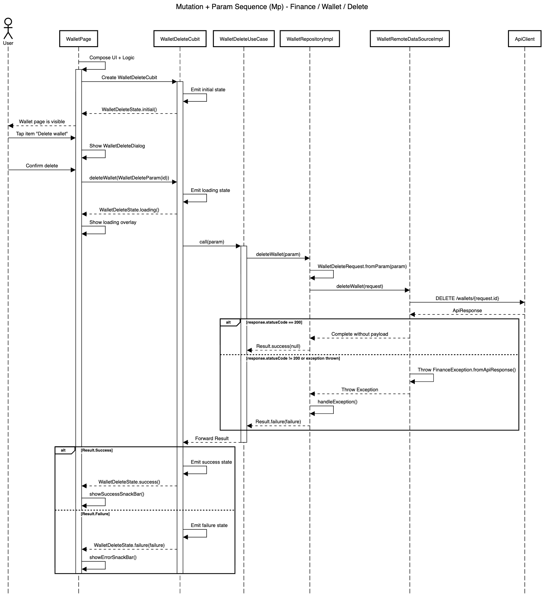

# Mutation + Param Blueprint

| Code | Sequence                      | Module       | Feature     | Feature Slice | Example Method           |
| ---- | ----------------------------- | ------------ | ----------- | ------------- | ------------------------ |
| Mp   | Mutation + Param              | finance      | wallet      | delete        | deleteWallet()           |



## **Layer: Data**

### **Datasources**

_modules/finance/lib/src/features/wallet/data/datasources/wallet_remote_data_source_impl.dart_

```dart
class WalletRemoteDataSourceImpl implements WalletRemoteDataSource {
  final ApiClient _apiClient;

  WalletRemoteDataSourceImpl({required ApiClient apiClient})
    : _apiClient = apiClient;

  @override
  Future<void> deleteWallet(WalletDeleteRequest request) async {
    final response = await _apiClient.delete('/wallets/${request.id}');
    if (response.statusCode == 200) {
      return;
    }

    throw FinanceException.fromApiResponse(response);
  }
}
```

&nbsp;

_modules/finance/lib/src/features/wallet/data/datasources/wallet_remote_data_source.dart_

```dart
abstract interface class WalletRemoteDataSource {
  Future<void> deleteWallet(WalletDeleteRequest request);
}
```

&nbsp;

### **Repositories**

_modules/finance/lib/src/features/wallet/data/repositories/wallet_repository_impl.dart_

```dart
class WalletRepositoryImpl
    with RepositoryExceptionHandler
    implements WalletRepository {
  final WalletRemoteDataSource _remoteDataSource;
  final AppLogger _log;

  const WalletRepositoryImpl({
    required WalletRemoteDataSource walletRemoteDataSource,
    required AppLogger appLogger,
  }) : _remoteDataSource = walletRemoteDataSource,
       _log = appLogger;

  @override
  AppLogger get log => _log;

  @override
  AsyncResult<void> deleteWallet(WalletDeleteParam param) async {
    final request = WalletDeleteRequest(id: param.id);

    try {
      await _remoteDataSource.deleteWallet(request);
      return const Result.success(null);
    } catch (e, st) {
      return handleException('deleteWallet', e, st);
    }
  }
}
```

&nbsp;

### **Requests**

_modules/finance/lib/src/features/wallet/data/requests/wallet_delete_request.dart_

```dart
@freezed
abstract class WalletDeleteRequest with _$WalletDeleteRequest {
  const WalletDeleteRequest._();

  const factory WalletDeleteRequest({required int id}) = _WalletDeleteRequest;

  factory WalletDeleteRequest.fromParam(WalletDeleteParam param) {
    return WalletDeleteRequest(id: param.id);
  }
}
```

&nbsp;

## **Layer: Domain**

### **Params**

_modules/finance/lib/src/features/wallet/domain/params/wallet_delete_param.dart_

```dart
@freezed
abstract class WalletDeleteParam with _$WalletDeleteParam {
  const factory WalletDeleteParam({required int id}) = _WalletDeleteParam;
}
```

&nbsp;

### **Repositories**

_modules/finance/lib/src/features/wallet/domain/repositories/wallet_repository.dart_

```dart
abstract interface class WalletRepository {
  AsyncResult<void> deleteWallet(WalletDeleteParam param);
}
```

&nbsp;

### **Usecases**

_modules/finance/lib/src/features/wallet/domain/usecases/wallet_delete_use_case.dart_

```dart
class WalletDeleteUseCase extends UseCase<void, WalletDeleteParam> {
  final WalletRepository _repository;

  WalletDeleteUseCase({required WalletRepository walletRepository})
    : _repository = walletRepository;

  @override
  AsyncResult<void> call(WalletDeleteParam param) {
    return _repository.deleteWallet(param);
  }
}
```

&nbsp;

## **Layer: Logic**

### **Delete**

_modules/finance/lib/src/features/wallet/logic/delete/wallet_delete_cubit.dart_

```dart
class WalletDeleteCubit extends Cubit<WalletDeleteState> {
  final WalletDeleteUseCase _useCase;

  WalletDeleteCubit({required WalletDeleteUseCase walletDeleteUseCase})
    : _useCase = walletDeleteUseCase,
      super(const WalletDeleteState.initial());

  Future<void> deleteWallet(WalletDeleteParam param) async {
    emit(const WalletDeleteState.loading());

    final result = await _useCase(param);

    emit(
      result.when(
        success: (_) => const WalletDeleteState.success(),
        failure: (failure) => WalletDeleteState.failure(failure: failure),
      ),
    );
  }
}
```

&nbsp;

_modules/finance/lib/src/features/wallet/logic/delete/wallet_delete_state.dart_

```dart
@freezed
sealed class WalletDeleteState with _$WalletDeleteState {
  const factory WalletDeleteState.initial() = _Initial;
  const factory WalletDeleteState.loading() = _Loading;
  const factory WalletDeleteState.success() = _Success;
  const factory WalletDeleteState.failure({required Failure failure}) =
      _Failure;
}
```

&nbsp;

## **Layer: Ui**

### **Delete**

_modules/finance/lib/src/features/wallet/ui/delete/widgets/wallet_delete_dialog.dart_

```dart
class WalletDeleteDialog extends StatelessWidget {
  final VoidCallback onConfirm;
  const WalletDeleteDialog({super.key, required this.onConfirm});

  @override
  Widget build(BuildContext context) {
    final l10n = context.l10n!;
    return AppConfirmationDialog(
      title: l10n.walletDeleteDialogTitle,
      message: l10n.walletDeleteDialogMessage,
      cancelText: l10n.walletDeleteDialogCancel,
      confirmText: l10n.walletDeleteDialogConfirm,
      onConfirm: onConfirm,
      isDestructive: true,
    );
  }

  Future<void> show(BuildContext context) {
    return showDialog(context: context, builder: (context) => this);
  }
}
```

&nbsp;

_modules/finance/lib/src/features/wallet/ui/delete/widgets/wallet_delete_popup_menu_item.dart_

```dart
class WalletDeletePopupMenuItem extends PopupMenuItem {
  static const valueKey = 'WalletDelete';

  const WalletDeletePopupMenuItem({super.key, super.onTap})
    : super(value: valueKey, child: const _Child());
}

class _Child extends StatelessWidget {
  const _Child();

  @override
  Widget build(BuildContext context) {
    final l10n = context.l10n!;
    return Row(
      children: [
        const Icon(Icons.delete, size: 20),
        AppGap.sm,
        Text(l10n.walletDeletePopupMenuItem),
      ],
    );
  }
}
```

&nbsp;

## **Barrel Files**

_modules/finance/lib/src/features/wallet/wallet_feature.dart_

```dart
export '../../templates/blueprints/data/datasources/wallet_remote_data_source.dart';
export '../../templates/blueprints/data/datasources/wallet_remote_data_source_impl.dart';
export '../../templates/blueprints/data/repositories/wallet_repository_impl.dart';
export '../../templates/blueprints/data/requests/wallet_delete_request.dart';

export '../../templates/blueprints/domain/params/wallet_delete_param.dart';
export '../../templates/blueprints/domain/repositories/wallet_repository.dart';
export '../../templates/blueprints/domain/usecases/wallet_delete_use_case.dart';

export '../../templates/blueprints/logic/delete/wallet_delete_cubit.dart';
export '../../templates/blueprints/logic/delete/wallet_delete_state.dart';

export '../../templates/blueprints/ui/delete/widgets/wallet_delete_dialog.dart';
export '../../templates/blueprints/ui/delete/widgets/wallet_delete_popup_menu_item.dart';
```

&nbsp;

