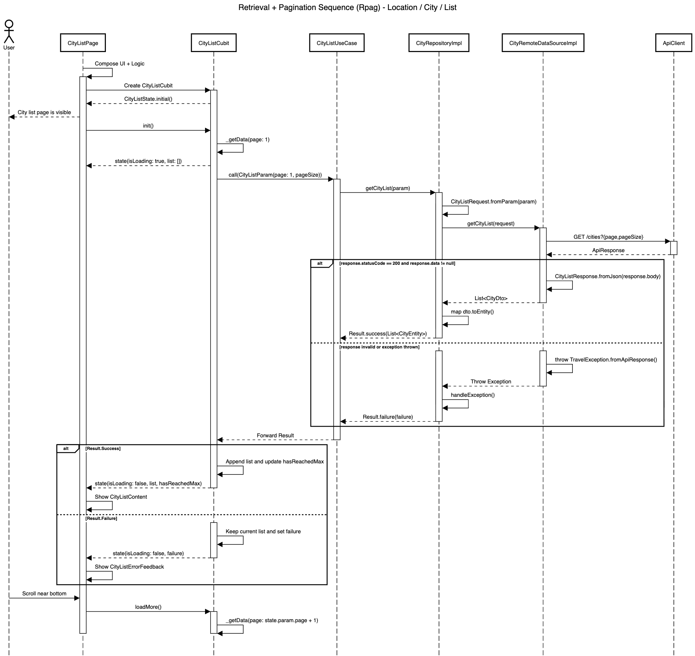

# Retrieval + Pagination Blueprint

| Code | Sequence                      | Module       | Feature     | Feature Slice | Example Method           |
| ---- | ----------------------------- | ------------ | ----------- | ------------- | ------------------------ |
| Rpag | Retrieval + Pagination        | location     | city        | list          | getCityList()            |



## **Layer: Data**

### **Datasources**

_modules/location/lib/src/features/city/data/datasources/city_remote_data_source_impl.dart_

```dart
class CityRemoteDataSourceImpl implements CityRemoteDataSource {
  final ApiClient _apiClient;

  const CityRemoteDataSourceImpl({required ApiClient apiClient})
    : _apiClient = apiClient;

  @override
  Future<List<CityDto>> getCityList(CityListRequest request) async {
    final response = await _apiClient.get<Map<String, dynamic>>(
      '/cities',
      queryParameters: request.toJson(),
    );

    if (response.statusCode == 200) {
      final cityListResponse = CityListResponse.fromJson(response.body);
      if (cityListResponse.data != null) {
        return cityListResponse.data!;
      }

      throw const CoreException.serverError();
    }

    throw LocationException.fromApiResponse(response);
  }
}
```

&nbsp;

_modules/location/lib/src/features/city/data/datasources/city_remote_data_source.dart_

```dart
abstract interface class CityRemoteDataSource {
  Future<List<CityDto>> getCityList(CityListRequest request);
}
```

&nbsp;

### **Dtos**

_modules/location/lib/src/features/city/data/dtos/city_dto.dart_

```dart
@freezed
abstract class CityDto with _$CityDto {
  const CityDto._();

  const factory CityDto({
    required int id,
    required String name,
    required String state,
    required String country,
  }) = _CityDto;

  factory CityDto.fromJson(Map<String, Object?> json) =>
      _$CityDtoFromJson(json);

  CityEntity toEntity() {
    return CityEntity(id: id, name: name, state: state, country: country);
  }
}
```

&nbsp;

### **Repositories**

_modules/location/lib/src/features/city/data/repositories/city_repository_impl.dart_

```dart
class CityRepositoryImpl
    with RepositoryExceptionHandler
    implements CityRepository {
  final CityRemoteDataSource _remoteDataSource;
  final AppLogger _log;

  const CityRepositoryImpl({
    required CityRemoteDataSource cityRemoteDataSource,
    required AppLogger appLogger,
  }) : _remoteDataSource = cityRemoteDataSource,
       _log = appLogger;

  @override
  AppLogger get log => _log;

  @override
  AsyncResult<List<CityEntity>> getCityList(CityListParam param) async {
    try {
      final request = CityListRequest.fromParam(param);
      final dtos = await _remoteDataSource.getCityList(request);
      final entities = dtos.map((dto) => dto.toEntity()).toList();
      return Result.success(entities);
    } catch (e, st) {
      return handleException('getCities', e, st);
    }
  }
}
```

&nbsp;

### **Requests**

_modules/location/lib/src/features/city/data/requests/city_list_request.dart_

```dart
@freezed
abstract class CityListRequest with _$CityListRequest {
  const CityListRequest._();

  const factory CityListRequest({required int page, required int pageSize}) =
      _CityListRequest;

  factory CityListRequest.fromJson(Map<String, Object?> json) =>
      _$CityListRequestFromJson(json);

  factory CityListRequest.fromParam(CityListParam param) {
    return CityListRequest(page: param.page, pageSize: param.pageSize);
  }
}
```

&nbsp;

### **Responses**

_modules/location/lib/src/features/city/data/responses/city_list_response.dart_

```dart
@freezed
abstract class CityListResponse with _$CityListResponse {
  const factory CityListResponse({
    required String status,
    required String message,
    Map<String, dynamic>? meta,
    @JsonKey(fromJson: _fromJson) List<CityDto>? data,
    String? code,
    List<String>? errors,
  }) = _CityListResponse;

  factory CityListResponse.fromJson(Map<String, dynamic> json) =>
      _$CityListResponseFromJson(json);
}

List<CityDto>? _fromJson(Object? json) {
  if (json is List) {
    return json
        .map((item) => CityDto.fromJson(item as Map<String, dynamic>))
        .toList();
  }
  return null;
}
```

&nbsp;

## **Layer: Domain**

### **Entities**

_modules/location/lib/src/features/city/domain/entities/city_entity.dart_

```dart
@freezed
abstract class CityEntity with _$CityEntity {
  const factory CityEntity({
    required int id,
    required String name,
    required String state,
    required String country,
  }) = _CityEntity;
}
```

&nbsp;

### **Params**

_modules/location/lib/src/features/city/domain/params/city_list_param.dart_

```dart
@freezed
abstract class CityListParam with _$CityListParam {
  const factory CityListParam({
    @Default(1) int page,
    @Default(15) int pageSize,
  }) = _CityListParam;
}
```

&nbsp;

### **Repositories**

_modules/location/lib/src/features/city/domain/repositories/city_repository.dart_

```dart
abstract interface class CityRepository {
  AsyncResult<List<CityEntity>> getCityList(CityListParam param);
}
```

&nbsp;

### **Usecases**

_modules/location/lib/src/features/city/domain/usecases/city_list_use_case.dart_

```dart
class CityListUseCase extends UseCase<List<CityEntity>, CityListParam> {
  final CityRepository _repository;

  const CityListUseCase({required CityRepository cityRepository})
    : _repository = cityRepository;

  @override
  AsyncResult<List<CityEntity>> call(CityListParam param) {
    return _repository.getCityList(param);
  }
}
```

&nbsp;

## **Layer: Logic**

### **List**

_modules/location/lib/src/features/city/logic/list/city_list_cubit.dart_

```dart
class CityListCubit extends Cubit<CityListState> {
  final CityListUseCase _useCase;

  CityListCubit({required CityListUseCase cityListUseCase})
    : _useCase = cityListUseCase,
      super(const CityListState());

  Future<void> init() async {
    await refresh();
  }

  Future<void> refresh() async {
    await _getData(page: 1);
  }

  Future<void> loadMore() async {
    if (state.isLoading || state.hasReachedMax) return;
    await _getData(page: state.param.page + 1);
  }

  Future<void> _getData({required int page}) async {
    emit(
      state.copyWith(
        isLoading: true,
        failure: null,
        list: page == 1 ? [] : state.list,
      ),
    );

    final selectedParam = state.param.copyWith(page: page);
    final result = await _useCase(selectedParam);

    emit(
      result.when(
        success: (data) => state.copyWith(
          list: [...state.list, ...data],
          hasReachedMax: data.length < state.param.pageSize,
          isLoading: false,
          param: selectedParam,
        ),
        failure: (failure) =>
            state.copyWith(isLoading: false, failure: failure),
      ),
    );
  }
}
```

&nbsp;

_modules/location/lib/src/features/city/logic/list/city_list_state.dart_

```dart
@freezed
abstract class CityListState with _$CityListState {
  const factory CityListState({
    @Default([]) List<CityEntity> list,
    @Default(false) bool hasReachedMax,
    @Default(false) bool isLoading,
    Failure? failure,
    @Default(CityListParam()) CityListParam param,
  }) = _CityListState;
}
```

&nbsp;

## **Layer: Ui**

### **List**

_modules/location/lib/src/features/city/ui/list/views/city_list_view.dart_

```dart
class CityListView extends StatelessWidget {
  final Widget content;
  const CityListView({super.key, required this.content});

  @override
  Widget build(BuildContext context) {
    final l10n = context.l10n!;
    return Scaffold(
      appBar: AppBar(title: Text(l10n.cityListTitle)),
      body: content,
    );
  }
}
```

&nbsp;

_modules/location/lib/src/features/city/ui/list/widgets/city_list_content.dart_

```dart
class CityListContent extends StatefulWidget {
  final Future<void> Function() onPullRefresh;
  final bool isLoadingMore;
  final VoidCallback onLoadMore;
  final List<CityEntity> list;
  final void Function(CityEntity item) onItemTap;

  const CityListContent({
    super.key,
    required this.list,
    required this.isLoadingMore,
    required this.onLoadMore,
    required this.onPullRefresh,
    required this.onItemTap,
  });

  @override
  State<CityListContent> createState() => _CityListContentState();
}

class _CityListContentState extends State<CityListContent> {
  static const _thresholdLoadMore = 0.9; // 90% of the scroll extent

  late final ScrollController _scrollController;

  void _onScroll() {
    if (_isReachThreshold) {
      widget.onLoadMore();
    }
  }

  bool get _isReachThreshold {
    if (!_scrollController.hasClients) return false;
    final maxScroll = _scrollController.position.maxScrollExtent;
    final currentScroll = _scrollController.offset;
    return currentScroll >= (maxScroll * _thresholdLoadMore) && maxScroll > 0;
  }

  @override
  void initState() {
    super.initState();
    _scrollController = ScrollController();
    _scrollController.addListener(_onScroll);
  }

  @override
  void dispose() {
    _scrollController.removeListener(_onScroll);
    _scrollController.dispose();
    super.dispose();
  }

  @override
  Widget build(BuildContext context) {
    return RefreshIndicator.adaptive(
      onRefresh: widget.onPullRefresh,
      child: ListView.separated(
        controller: _scrollController,
        itemCount: widget.list.length,
        padding: const EdgeInsets.only(bottom: 80),
        separatorBuilder: (context, index) => const Divider(),
        itemBuilder: (context, index) {
          final item = widget.list[index];
          final tile = CityListItem(
            city: item,
            number: index + 1,
            onTap: () => widget.onItemTap.call(item),
          );
          if (index == widget.list.length - 1) {
            return Column(
              mainAxisSize: MainAxisSize.min,
              children: [tile, if (widget.isLoadingMore) const AppLoading()],
            );
          }
          return tile;
        },
      ),
    );
  }
}
```

&nbsp;

_modules/location/lib/src/features/city/ui/list/widgets/city_list_empty_feedback.dart_

```dart
class CityListEmptyFeedback extends StatelessWidget {
  final VoidCallback onRefresh;
  const CityListEmptyFeedback({super.key, required this.onRefresh});

  @override
  Widget build(BuildContext context) {
    final l10n = context.l10n!;
    return AppEmptyFeedback(
      title: l10n.cityListEmptyTitle,
      message: l10n.cityListEmptyMessage,
      onRefresh: onRefresh,
      refreshText: l10n.refresh,
    );
  }
}
```

&nbsp;

_modules/location/lib/src/features/city/ui/list/widgets/city_list_error_feedback.dart_

```dart
class CityListErrorFeedback extends StatelessWidget {
  final String message;
  final VoidCallback onRetry;
  const CityListErrorFeedback({
    super.key,
    required this.message,
    required this.onRetry,
  });

  @override
  Widget build(BuildContext context) {
    final l10n = context.l10n!;
    return AppErrorFeedback(
      title: l10n.cityListErrorTitle,
      message: message,
      retryText: l10n.retry,
      onRetry: onRetry,
    );
  }
}
```

&nbsp;

_modules/location/lib/src/features/city/ui/list/widgets/city_list_skeleton.dart_

```dart
class CityListSkeleton extends StatelessWidget {
  final int itemCount;
  const CityListSkeleton({super.key, this.itemCount = 10});

  @override
  Widget build(BuildContext context) {
    return ListView.separated(
      itemBuilder: (context, index) => const CityListItemSkeleton(),
      itemCount: itemCount,
      padding: const EdgeInsets.all(AppSpacing.screen),
      separatorBuilder: (context, index) => AppGap.md,
    );
  }
}
```

&nbsp;

_modules/location/lib/src/features/city/ui/list/widgets/parts/city_list_item_skeleton.dart_

```dart
class CityListItemSkeleton extends StatelessWidget {
  const CityListItemSkeleton({super.key});

  @override
  Widget build(BuildContext context) {
    return const AppListTileSkeleton();
  }
}
```

&nbsp;

_modules/location/lib/src/features/city/ui/list/widgets/parts/city_list_item.dart_

```dart
class CityListItem extends StatelessWidget {
  final CityEntity city;
  final int number;
  final VoidCallback? onTap;
  const CityListItem({
    super.key,
    required this.city,
    required this.number,
    this.onTap,
  });

  @override
  Widget build(BuildContext context) {
    return AppListTile(
      leading: AppLeadingIndex(number: number),
      title: city.name,
      subtitle: '${city.state}, ${city.country}',
      onTap: onTap,
      includeChevron: true,
    );
  }
}
```

&nbsp;

## **Barrel Files**

_modules/location/lib/src/features/city/city_feature.dart_

```dart
export '../../templates/blueprints/data/datasources/city_remote_data_source.dart';
export '../../templates/blueprints/data/datasources/city_remote_data_source_impl.dart';
export '../../templates/blueprints/data/repositories/city_repository_impl.dart';
export '../../templates/blueprints/domain/entities/city_entity.dart';
export '../../templates/blueprints/domain/params/city_list_param.dart';
export '../../templates/blueprints/domain/repositories/city_repository.dart';
export '../../templates/blueprints/domain/usecases/city_list_use_case.dart';
export '../../templates/blueprints/logic/list/city_list_cubit.dart';
export '../../templates/blueprints/logic/list/city_list_state.dart';
export '../../templates/blueprints/ui/list/views/city_list_view.dart';
export '../../templates/blueprints/ui/list/widgets/city_list_content.dart';
export '../../templates/blueprints/ui/list/widgets/city_list_empty_feedback.dart';
export '../../templates/blueprints/ui/list/widgets/city_list_error_feedback.dart';
export '../../templates/blueprints/ui/list/widgets/city_list_skeleton.dart';
```

&nbsp;

