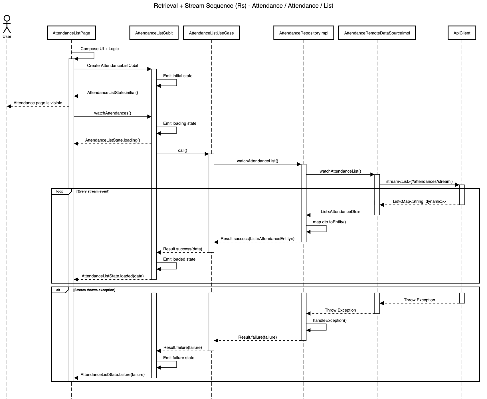

# Retrieval + Stream Blueprint

| Code | Sequence                      | Module       | Feature     | Feature Slice | Example Method           |
| ---- | ----------------------------- | ------------ | ----------- | ------------- | ------------------------ |
| Rs   | Retrieval + Stream            | attendance   | attendance  | list          | watchAttendanceList()    |




## **Layer: Data**

### **Converters**

_modules/attendance/lib/src/features/attendance/data/converters/attendance_type_converter.dart_

```dart
class AttendanceTypeConverter extends JsonConverter<AttendanceType, String> {
  const AttendanceTypeConverter();

  @override
  AttendanceType fromJson(String json) {
    return switch (json) {
      'clock_in' => AttendanceType.clockIn,
      'clock_out' => AttendanceType.clockOut,
      _ => AttendanceType.clockIn,
    };
  }

  @override
  String toJson(AttendanceType object) {
    return switch (object) {
      AttendanceType.clockIn => 'clock_in',
      AttendanceType.clockOut => 'clock_out',
    };
  }
}
```

&nbsp;

### **Datasources**

_modules/attendance/lib/src/features/attendance/data/datasources/attendance_remote_data_source_impl.dart_

```dart
class AttendanceRemoteDataSourceImpl implements AttendanceRemoteDataSource {
  final ApiClient _apiClient;

  const AttendanceRemoteDataSourceImpl({required ApiClient apiClient})
    : _apiClient = apiClient;

  @override
  Stream<List<AttendanceDto>> watchAttendanceList() {
    return _apiClient.stream<List>('/attendances/stream').map((data) {
      return data
          .map((e) => AttendanceDto.fromJson(e as Map<String, dynamic>))
          .toList();
    });
  }
}
```

&nbsp;

_modules/attendance/lib/src/features/attendance/data/datasources/attendance_remote_data_source.dart_

```dart
abstract interface class AttendanceRemoteDataSource {
  Stream<List<AttendanceDto>> watchAttendanceList();
}
```

&nbsp;

### **Dtos**

_modules/attendance/lib/src/features/attendance/data/dtos/attendance_dto.dart_

```dart
@freezed
abstract class AttendanceDto with _$AttendanceDto {
  const AttendanceDto._();

  const factory AttendanceDto({
    required int id,
    required String userId,
    @AttendanceTypeConverter() required AttendanceType type,
    @UtcDateTimeConverter() required DateTime clockAt,
    @UtcDateTimeConverter() required DateTime createdAt,
    @UtcDateTimeConverter() required DateTime updatedAt,
  }) = _AttendanceDto;

  factory AttendanceDto.fromJson(Map<String, Object?> json) =>
      _$AttendanceDtoFromJson(json);

  AttendanceEntity toEntity() {
    return AttendanceEntity(
      id: id,
      userId: userId,
      type: type,
      clockAt: clockAt,
    );
  }
}
```

&nbsp;

### **Repositories**

_modules/attendance/lib/src/features/attendance/data/repositories/attendance_repository_impl.dart_

```dart
class AttendanceRepositoryImpl
    with RepositoryExceptionHandler
    implements AttendanceRepository {
  final AttendanceRemoteDataSource _remoteDataSource;
  final AppLogger _log;

  const AttendanceRepositoryImpl({
    required AttendanceRemoteDataSource attendanceRemoteDataSource,
    required AppLogger appLogger,
  }) : _remoteDataSource = attendanceRemoteDataSource,
       _log = appLogger;

  @override
  AppLogger get log => _log;

  @override
  StreamResult<List<AttendanceEntity>> watchAttendanceList() async* {
    try {
      final stream = _remoteDataSource.watchAttendanceList();

      await for (final dtos in stream) {
        final entities = dtos.map((dto) => dto.toEntity()).toList();
        yield Result.success(entities);
      }
    } catch (e, st) {
      yield handleException('watchAttendanceList', e, st);
    }
  }
}
```

&nbsp;

## **Layer: Domain**

### **Entities**

_modules/attendance/lib/src/features/attendance/domain/entities/attendance_entity.dart_

```dart
@freezed
abstract class AttendanceEntity with _$AttendanceEntity {
  const factory AttendanceEntity({
    required int id,
    required String userId,
    required AttendanceType type,
    required DateTime clockAt,
  }) = _AttendanceEntity;
}
```

&nbsp;

### **Enums**

_modules/attendance/lib/src/features/attendance/domain/enums/attendance_type.dart_

```dart
enum AttendanceType { clockIn, clockOut }
```

&nbsp;

### **Repositories**

_modules/attendance/lib/src/features/attendance/domain/repositories/attendance_repository.dart_

```dart
abstract interface class AttendanceRepository {
  StreamResult<List<AttendanceEntity>> watchAttendanceList();
}
```

&nbsp;

### **Usecases**

_modules/attendance/lib/src/features/attendance/domain/usecases/attendance_list_use_case.dart_

```dart
class AttendanceListUseCase
    extends NoParamStreamUseCase<List<AttendanceEntity>> {
  final AttendanceRepository _repository;

  const AttendanceListUseCase({
    required AttendanceRepository attendanceRepository,
  }) : _repository = attendanceRepository;

  @override
  StreamResult<List<AttendanceEntity>> call() =>
      _repository.watchAttendanceList();
}
```

&nbsp;

## **Layer: Logic**

### **List**

_modules/attendance/lib/src/features/attendance/logic/list/attendance_list_cubit.dart_

```dart
class AttendanceListCubit extends Cubit<AttendanceListState> {
  final AttendanceListUseCase _useCase;

  StreamSubscription<Result<List<AttendanceEntity>>>? _subscription;

  AttendanceListCubit({required AttendanceListUseCase attendanceListUseCase})
    : _useCase = attendanceListUseCase,
      super(const AttendanceListState.initial());

  void watchAttendances() {
    emit(const AttendanceListState.loading());

    _subscription?.cancel();
    _subscription = _useCase().listen(
      (result) {
        emit(
          result.when(
            success: (data) => AttendanceListState.loaded(data: data),
            failure: (failure) => AttendanceListState.failure(failure: failure),
          ),
        );
      },
      onError: (e) {
        emit(
          AttendanceListState.failure(
            failure: CoreException.fromException(
              e.toString(),
              st: StackTrace.current,
            ).toFailure(),
          ),
        );
      },
    );
  }

  @override
  Future<void> close() {
    _subscription?.cancel();
    return super.close();
  }
}
```

&nbsp;

_modules/attendance/lib/src/features/attendance/logic/list/attendance_list_state.dart_

```dart
@freezed
sealed class AttendanceListState with _$AttendanceListState {
  const factory AttendanceListState.initial() = _Initial;
  const factory AttendanceListState.loading() = _Loading;
  const factory AttendanceListState.loaded({
    required List<AttendanceEntity> data,
  }) = _Loaded;
  const factory AttendanceListState.failure({required Failure failure}) =
      _Failure;
}
```

&nbsp;

## **Layer: Ui**

### **Extensions**

_modules/attendance/lib/src/features/attendance/ui/extensions/attendance_type_x.dart_

```dart
extension AttendanceTypeX on AttendanceType {
  String localize(BuildContext context) {
    final l10n = context.l10n!;
    return switch (this) {
      AttendanceType.clockIn => l10n.attendanceTypeClockIn,
      AttendanceType.clockOut => l10n.attendanceTypeClockOut,
    };
  }
}
```

&nbsp;

### **List**

_modules/attendance/lib/src/features/attendance/ui/list/views/attendance_list_view.dart_

```dart
class AttendanceListView extends StatelessWidget {
  final Widget content;
  const AttendanceListView({super.key, required this.content});

  @override
  Widget build(BuildContext context) {
    final l10n = context.l10n!;
    return Scaffold(
      appBar: AppBar(title: Text(l10n.attendanceListTitle)),
      body: content,
    );
  }
}
```

&nbsp;

_modules/attendance/lib/src/features/attendance/ui/list/widgets/attendance_list_content.dart_

```dart
class AttendanceListContent extends StatelessWidget {
  final List<AttendanceEntity> list;
  final void Function(AttendanceEntity item) onItemTap;
  const AttendanceListContent({
    super.key,
    required this.list,
    required this.onItemTap,
  });

  @override
  Widget build(BuildContext context) {
    return ListView.separated(
      itemCount: list.length,
      separatorBuilder: (context, index) => const Divider(),
      itemBuilder: (context, index) {
        final item = list[index];
        return AttendanceListItem(
          attendance: item,
          onTap: () => onItemTap(item),
        );
      },
    );
  }
}
```

&nbsp;

_modules/attendance/lib/src/features/attendance/ui/list/widgets/attendance_list_empty_feedback.dart_

```dart
class AttendanceListEmptyFeedback extends StatelessWidget {
  final VoidCallback onRefresh;
  const AttendanceListEmptyFeedback({super.key, required this.onRefresh});

  @override
  Widget build(BuildContext context) {
    final l10n = context.l10n!;
    return AppEmptyFeedback(
      title: l10n.attendanceListEmptyTitle,
      message: l10n.attendanceListEmptyMessage,
      onRefresh: onRefresh,
      refreshText: l10n.refresh,
    );
  }
}
```

&nbsp;

_modules/attendance/lib/src/features/attendance/ui/list/widgets/attendance_list_error_feedback.dart_

```dart
class AttendanceListErrorFeedback extends StatelessWidget {
  final String message;
  final VoidCallback? onRetry;
  const AttendanceListErrorFeedback({
    super.key,
    required this.message,
    this.onRetry,
  });

  @override
  Widget build(BuildContext context) {
    final l10n = context.l10n!;
    return AppErrorFeedback(
      title: l10n.attendanceListErrorTitle,
      message: message,
      onRetry: onRetry,
      retryText: l10n.retry,
    );
  }
}
```

&nbsp;

_modules/attendance/lib/src/features/attendance/ui/list/widgets/attendance_list_skeleton.dart_

```dart
class AttendanceListSkeleton extends StatelessWidget {
  final int itemCount;
  const AttendanceListSkeleton({super.key, this.itemCount = 10});

  @override
  Widget build(BuildContext context) {
    return ListView.separated(
      itemCount: itemCount,
      separatorBuilder: (context, index) => const Divider(),
      itemBuilder: (context, index) {
        return const AttendanceListItemSkeleton();
      },
    );
  }
}
```

&nbsp;

_modules/attendance/lib/src/features/attendance/ui/list/widgets/parts/attendance_list_item_skeleton.dart_

```dart
class AttendanceListItemSkeleton extends StatelessWidget {
  const AttendanceListItemSkeleton({super.key});

  @override
  Widget build(BuildContext context) {
    return const AppListTileSkeleton();
  }
}
```

&nbsp;

_modules/attendance/lib/src/features/attendance/ui/list/widgets/parts/attendance_list_item.dart_

```dart
class AttendanceListItem extends StatelessWidget {
  final AttendanceEntity attendance;
  final VoidCallback? onTap;
  const AttendanceListItem({super.key, required this.attendance, this.onTap});

  @override
  Widget build(BuildContext context) {
    return AppListTile(
      leading: AppLeadingId(id: '${attendance.id}'),
      title: attendance.userId,
      subtitle:
          '${attendance.type.localize(context)} - ${DateFormat('HH:mm:sss').format(attendance.clockAt)}',
      onTap: onTap,
      includeChevron: true,
    );
  }
}
```

&nbsp;

## **Barrel Files**

_modules/attendance/lib/src/features/attendance/attendance_feature.dart_

```dart
export '../../templates/blueprints/data/datasources/attendance_remote_data_source.dart';
export '../../templates/blueprints/data/datasources/attendance_remote_data_source_impl.dart';
export '../../templates/blueprints/data/repositories/attendance_repository_impl.dart';
export '../../templates/blueprints/domain/entities/attendance_entity.dart';
export '../../templates/blueprints/domain/repositories/attendance_repository.dart';
export '../../templates/blueprints/domain/usecases/attendance_list_use_case.dart';
export '../../templates/blueprints/logic/list/attendance_list_cubit.dart';
export '../../templates/blueprints/logic/list/attendance_list_state.dart';
export '../../templates/blueprints/ui/list/views/attendance_list_view.dart';
export '../../templates/blueprints/ui/list/widgets/attendance_list_content.dart';
export '../../templates/blueprints/ui/list/widgets/attendance_list_empty_feedback.dart';
export '../../templates/blueprints/ui/list/widgets/attendance_list_error_feedback.dart';
export '../../templates/blueprints/ui/list/widgets/attendance_list_skeleton.dart';
```

&nbsp;

