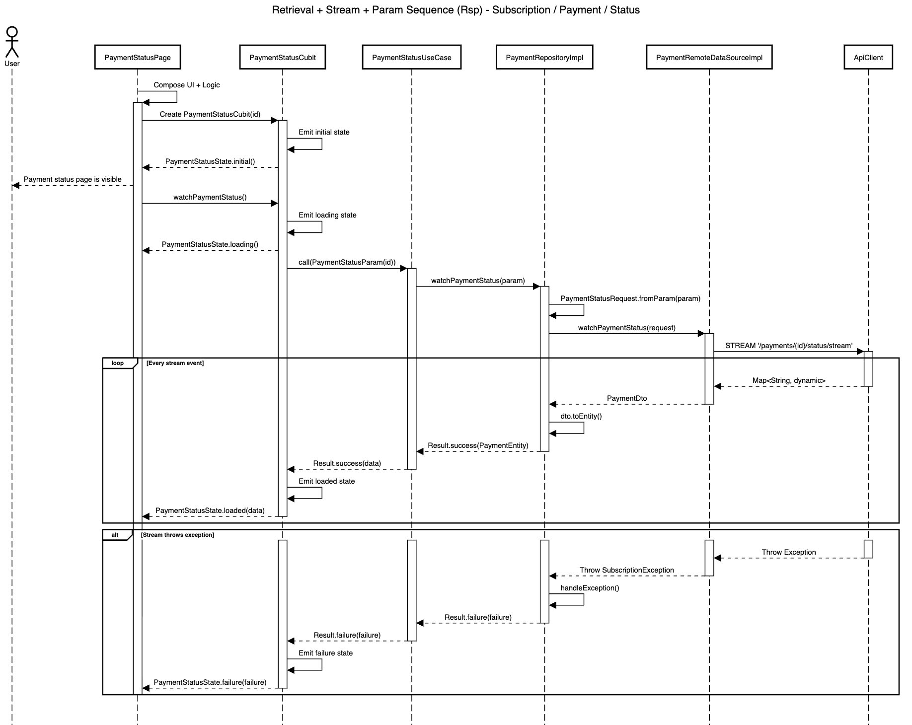

# Retrieval + Stream + Param Blueprint

| Code | Sequence                      | Module       | Feature     | Feature Slice | Example Method           |
| ---- | ----------------------------- | ------------ | ----------- | ------------- | ------------------------ |
| Rsp  | Retrieval + Stream + Param    | subscription | payment     | status        | watchPaymentStatus()     |



## **Layer: Data**

### **Converters**

_modules/subscription/lib/src/features/payment/data/converters/payment_status_converter.dart_

```dart
class PaymentStatusConverter extends JsonConverter<PaymentStatus, String> {
  const PaymentStatusConverter();

  @override
  PaymentStatus fromJson(String json) {
    return switch (json) {
      'unpaid' => PaymentStatus.unpaid,
      'paid' => PaymentStatus.paid,
      'expired' => PaymentStatus.expired,
      _ => PaymentStatus.unpaid,
    };
  }

  @override
  String toJson(PaymentStatus object) {
    return switch (object) {
      PaymentStatus.unpaid => 'unpaid',
      PaymentStatus.paid => 'paid',
      PaymentStatus.expired => 'expired',
    };
  }
}
```

&nbsp;

### **Datasources**

_modules/subscription/lib/src/features/payment/data/datasources/payment_remote_data_source_impl.dart_

```dart
class PaymentRemoteDataSourceImpl implements PaymentRemoteDataSource {
  final ApiClient _apiClient;

  const PaymentRemoteDataSourceImpl({required ApiClient apiClient})
    : _apiClient = apiClient;

  @override
  Stream<PaymentDto> watchPaymentStatus(
    PaymentStatusRequest paymentStatusRequest,
  ) async* {
    final path = '/payments/${paymentStatusRequest.id}/status/stream';
    try {
      await for (final data in _apiClient.stream<Map<String, dynamic>>(path)) {
        yield PaymentDto.fromJson(data);
      }
    } catch (e, st) {
      if (e is AppException) {
        if (e.message.contains('status code') && e.message.contains('404')) {
          throw SubscriptionException.paymentNotFound(msg: e.message, st: st);
        }
      }
      throw SubscriptionException.fromException(e, st: st);
    }
  }
}
```

&nbsp;

_modules/subscription/lib/src/features/payment/data/datasources/payment_remote_data_source.dart_

```dart
abstract interface class PaymentRemoteDataSource {
  Stream<PaymentDto> watchPaymentStatus(
    PaymentStatusRequest paymentStatusRequest,
  );
}
```

&nbsp;

### **Dtos**

_modules/subscription/lib/src/features/payment/data/dtos/payment_dto.dart_

```dart
@freezed
abstract class PaymentDto with _$PaymentDto {
  const PaymentDto._();

  const factory PaymentDto({
    required String id,
    required String userId,
    required double amount,
    required String currency,
    @PaymentStatusConverter() required PaymentStatus status,
    @UtcDateTimeConverter() required DateTime createdAt,
    @UtcDateTimeConverter() required DateTime updatedAt,
  }) = _PaymentDto;

  factory PaymentDto.fromJson(Map<String, Object?> json) =>
      _$PaymentDtoFromJson(json);

  PaymentEntity toEntity() {
    return PaymentEntity(
      id: id,
      userId: userId,
      amount: amount,
      currency: currency,
      status: status,
      createdAt: createdAt,
      updatedAt: updatedAt,
    );
  }
}
```

&nbsp;

### **Repositories**

_modules/subscription/lib/src/features/payment/data/repositories/payment_repository_impl.dart_

```dart
class PaymentRepositoryImpl
    with RepositoryExceptionHandler
    implements PaymentRepository {
  final PaymentRemoteDataSource _remoteDataSource;
  final AppLogger _log;

  const PaymentRepositoryImpl({
    required PaymentRemoteDataSource paymentRemoteDataSource,
    required AppLogger appLogger,
  }) : _remoteDataSource = paymentRemoteDataSource,
       _log = appLogger;

  @override
  AppLogger get log => _log;

  @override
  StreamResult<PaymentEntity> watchPaymentStatus(
    PaymentStatusParam param,
  ) async* {
    try {
      final request = PaymentStatusRequest.fromParam(param);
      final stream = _remoteDataSource.watchPaymentStatus(request);

      await for (final dto in stream) {
        final entity = dto.toEntity();
        yield Result.success(entity);
      }
    } catch (e, st) {
      yield handleException('watchPaymentStatus', e, st);
    }
  }
}
```

&nbsp;

### **Requests**

_modules/subscription/lib/src/features/payment/data/requests/payment_status_request.dart_

```dart
@freezed
abstract class PaymentStatusRequest with _$PaymentStatusRequest {
  const PaymentStatusRequest._();

  const factory PaymentStatusRequest({required String id}) =
      _PaymentStatusRequest;

  factory PaymentStatusRequest.fromJson(Map<String, Object?> json) =>
      _$PaymentStatusRequestFromJson(json);

  factory PaymentStatusRequest.fromParam(PaymentStatusParam param) {
    return PaymentStatusRequest(id: param.id);
  }
}
```

&nbsp;

## **Layer: Domain**

### **Entities**

_modules/subscription/lib/src/features/payment/domain/entities/payment_entity.dart_

```dart
@freezed
abstract class PaymentEntity with _$PaymentEntity {
  const factory PaymentEntity({
    required String id,
    required String userId,
    required double amount,
    required String currency,
    required PaymentStatus status,
    required DateTime createdAt,
    required DateTime updatedAt,
  }) = _PaymentEntity;
}
```

&nbsp;

### **Enums**

_modules/subscription/lib/src/features/payment/domain/enums/payment_status.dart_

```dart
enum PaymentStatus { unpaid, paid, expired }
```

&nbsp;

### **Params**

_modules/subscription/lib/src/features/payment/domain/params/payment_status_param.dart_

```dart
@freezed
abstract class PaymentStatusParam with _$PaymentStatusParam {
  const factory PaymentStatusParam({required String id}) = _PaymentStatusParam;
}
```

&nbsp;

### **Repositories**

_modules/subscription/lib/src/features/payment/domain/repositories/payment_repository.dart_

```dart
abstract interface class PaymentRepository {
  StreamResult<PaymentEntity> watchPaymentStatus(PaymentStatusParam param);
}
```

&nbsp;

### **Usecases**

_modules/subscription/lib/src/features/payment/domain/usecases/payment_status_use_case.dart_

```dart
class PaymentStatusUseCase
    extends StreamUseCase<PaymentEntity, PaymentStatusParam> {
  final PaymentRepository _repository;

  const PaymentStatusUseCase({required PaymentRepository paymentRepository})
    : _repository = paymentRepository;

  @override
  StreamResult<PaymentEntity> call(PaymentStatusParam param) {
    return _repository.watchPaymentStatus(param);
  }
}
```

&nbsp;

## **Layer: Logic**

### **Status**

_modules/subscription/lib/src/features/payment/logic/status/payment_status_cubit.dart_

```dart
class PaymentStatusCubit extends Cubit<PaymentStatusState> {
  final PaymentStatusUseCase _useCase;
  final String _id;

  StreamSubscription<Result<PaymentEntity>>? _subscription;

  PaymentStatusCubit({
    required PaymentStatusUseCase paymentStatusUseCase,
    required String id,
  }) : _useCase = paymentStatusUseCase,
       _id = id,
       super(const PaymentStatusState.initial());

  void watchPaymentStatus() {
    emit(const PaymentStatusState.loading());

    _subscription?.cancel();
    final param = PaymentStatusParam(id: _id);
    _subscription = _useCase(param).listen(_onData, onError: _onError);
  }

  void _onData(Result<PaymentEntity> result) {
    emit(
      result.when(
        success: (data) => PaymentStatusState.loaded(data: data),
        failure: (failure) => PaymentStatusState.failure(failure: failure),
      ),
    );
  }

  void _onError(dynamic e) {
    emit(
      PaymentStatusState.failure(
        failure: CoreException.fromException(
          e.toString(),
          st: StackTrace.current,
        ).toFailure(),
      ),
    );
  }

  @override
  Future<void> close() {
    _subscription?.cancel();
    return super.close();
  }
}
```

&nbsp;

_modules/subscription/lib/src/features/payment/logic/status/payment_status_state.dart_

```dart
@freezed
sealed class PaymentStatusState with _$PaymentStatusState {
  const factory PaymentStatusState.initial() = _Initial;
  const factory PaymentStatusState.loading() = _Loading;
  const factory PaymentStatusState.loaded({required PaymentEntity data}) =
      _Loaded;
  const factory PaymentStatusState.failure({required Failure failure}) =
      _Failure;
}
```

&nbsp;

## **Layer: Ui**

### **Shared**

_modules/subscription/lib/src/features/payment/ui/shared/extension/payment_status_x.dart_

```dart
extension PaymentStatusX on PaymentStatus {
  String localizeLabel(BuildContext context) {
    final l10n = context.l10n!;
    return switch (this) {
      PaymentStatus.unpaid => l10n.paymentStatusUnpaidLabel,
      PaymentStatus.paid => l10n.paymentStatusPaidLabel,
      PaymentStatus.expired => l10n.paymentStatusExpiredLabel,
    };
  }

  String localizeMessage(BuildContext context) {
    final l10n = context.l10n!;
    return switch (this) {
      PaymentStatus.unpaid => l10n.paymentStatusUnpaidMessage,
      PaymentStatus.paid => l10n.paymentStatusPaidMessage,
      PaymentStatus.expired => l10n.paymentStatusExpiredMessage,
    };
  }

  Color getColor(BuildContext context) {
    final isDark = MediaQuery.of(context).platformBrightness == Brightness.dark;

    if (isDark) {
      return switch (this) {
        PaymentStatus.unpaid => Colors.amberAccent,
        PaymentStatus.paid => Colors.greenAccent,
        PaymentStatus.expired => Colors.redAccent,
      };
    }

    return switch (this) {
      PaymentStatus.unpaid => Colors.amber.shade900,
      PaymentStatus.paid => Colors.green.shade900,
      PaymentStatus.expired => Colors.red.shade900,
    };
  }

  IconData get icon {
    return switch (this) {
      PaymentStatus.unpaid => Icons.schedule_rounded,
      PaymentStatus.paid => Icons.check_circle_outline_rounded,
      PaymentStatus.expired => Icons.error_outline_rounded,
    };
  }
}
```

&nbsp;

### **Status**

_modules/subscription/lib/src/features/payment/ui/status/views/payment_status_view.dart_

```dart
class PaymentStatusView extends StatelessWidget {
  final Widget content;
  const PaymentStatusView({super.key, required this.content});

  @override
  Widget build(BuildContext context) {
    final l10n = context.l10n!;
    return Scaffold(
      appBar: AppBar(
        automaticallyImplyLeading: false,
        title: Text(l10n.paymentStatusTitle),
      ),
      body: content,
    );
  }
}
```

&nbsp;

_modules/subscription/lib/src/features/payment/ui/status/widgets/payment_status_content.dart_

```dart
class PaymentStatusContent extends StatelessWidget {
  final PaymentEntity payment;
  final VoidCallback? onBackToDashboard;
  final VoidCallback? onPayNow;
  const PaymentStatusContent({
    super.key,
    required this.payment,
    this.onBackToDashboard,
    this.onPayNow,
  });

  @override
  Widget build(BuildContext context) {
    final l10n = context.l10n!;
    final textTheme = Theme.of(context).textTheme;

    final status = payment.status;
    final color = status.getColor(context);

    return Align(
      alignment: const Alignment(0, -0.5),
      child: Column(
        mainAxisSize: MainAxisSize.min,
        children: [
          CircleAvatar(
            radius: 120,
            backgroundColor: color.withValues(alpha: .05),
            child: CircleAvatar(
              radius: 90,
              backgroundColor: color.withValues(alpha: .15),
              child: CircleAvatar(
                radius: 60,
                backgroundColor: color.withValues(alpha: 0.7),
                child: Icon(status.icon, color: Colors.white, size: 80),
              ),
            ),
          ),
          AppGap.lg,
          Text(status.localizeLabel(context), style: textTheme.titleLarge),
          AppGap.sm,
          Padding(
            padding: const EdgeInsets.symmetric(horizontal: AppSpacing.xl),
            child: Text(
              payment.status.localizeMessage(context),
              style: textTheme.bodyMedium,
              textAlign: TextAlign.center,
            ),
          ),

          AppGap.xl,

          AppCard(
            margin: const EdgeInsetsGeometry.symmetric(
              horizontal: AppSpacing.xl,
            ),
            children: [
              AppInfoTile(title: l10n.paymentIdLabel, data: payment.id),
              AppInfoTile(
                title: l10n.paymentCreatedAtLabel,
                data: DateFormat.yMMMd().add_jm().format(payment.createdAt),
              ),
            ],
          ),

          AppGap.lg,

          switch (status) {
            PaymentStatus.unpaid => FilledButton(
              onPressed: onPayNow,
              child: Text(l10n.paymentStatusActionPayNow),
            ),
            _ => FilledButton(
              onPressed: onBackToDashboard,
              child: Text(l10n.paymentStatusActionBackToDashboard),
            ),
          },
        ],
      ),
    );
  }
}
```

&nbsp;

_modules/subscription/lib/src/features/payment/ui/status/widgets/payment_status_error_feedback.dart_

```dart
class PaymentStatusErrorFeedback extends StatelessWidget {
  final String message;
  final VoidCallback onRetry;
  const PaymentStatusErrorFeedback({
    super.key,
    required this.message,
    required this.onRetry,
  });

  @override
  Widget build(BuildContext context) {
    final l10n = context.l10n!;
    return AppErrorFeedback(
      title: l10n.paymentStatusErrorTitle,
      message: message,
      retryText: l10n.retry,
      onRetry: onRetry,
    );
  }
}
```

&nbsp;

_modules/subscription/lib/src/features/payment/ui/status/widgets/payment_status_skeleton.dart_

```dart
class PaymentStatusSkeleton extends StatelessWidget {
  const PaymentStatusSkeleton({super.key});

  @override
  Widget build(BuildContext context) {
    return Align(
      alignment: const Alignment(0, -0.5),
      child: Column(
        mainAxisSize: MainAxisSize.min,
        children: [
          // 1. Icon Placeholder
          AppShimmer.circle(size: 240),

          AppGap.lg,

          // 2. Status Label Placeholder
          const AppShimmer(width: 140, height: 24, radius: 6),

          AppGap.sm,

          // 3. Status Message Placeholder
          const Padding(
            padding: EdgeInsets.symmetric(horizontal: AppSpacing.xl),
            child: AppShimmer(width: 220, height: 16, radius: 4),
          ),

          AppGap.xl,

          // 4. AppCard Placeholder for InfoTiles (ID, Created At)
          const AppCard(
            margin: EdgeInsets.symmetric(horizontal: AppSpacing.xl),
            children: [
              Padding(
                padding: EdgeInsets.all(AppSpacing.md),
                child: Row(
                  mainAxisAlignment: MainAxisAlignment.spaceBetween,
                  children: [
                    AppShimmer(width: 80, height: 16, radius: 4),
                    AppShimmer(width: 120, height: 16, radius: 4),
                  ],
                ),
              ),
              Padding(
                padding: EdgeInsets.all(AppSpacing.md),
                child: Row(
                  mainAxisAlignment: MainAxisAlignment.spaceBetween,
                  children: [
                    AppShimmer(width: 100, height: 16, radius: 4),
                    AppShimmer(width: 140, height: 16, radius: 4),
                  ],
                ),
              ),
            ],
          ),

          AppGap.lg,

          // 5. Button Placeholder
          const AppShimmer(width: 200, height: 54, radius: 12),
        ],
      ),
    );
  }
}
```

&nbsp;

## **Barrel Files**

_modules/subscription/lib/src/features/payment/payment_feature.dart_

```dart
export '../../templates/blueprints/data/datasources/payment_remote_data_source.dart';
export '../../templates/blueprints/data/datasources/payment_remote_data_source_impl.dart';
export '../../templates/blueprints/data/repositories/payment_repository_impl.dart';
export '../../templates/blueprints/domain/entities/payment_entity.dart';
export '../../templates/blueprints/domain/params/payment_status_param.dart';
export '../../templates/blueprints/domain/repositories/payment_repository.dart';
export '../../templates/blueprints/domain/usecases/payment_status_use_case.dart';
export '../../templates/blueprints/logic/status/payment_status_cubit.dart';
export '../../templates/blueprints/logic/status/payment_status_state.dart';
export '../../templates/blueprints/ui/status/views/payment_status_view.dart';
export '../../templates/blueprints/ui/status/widgets/payment_status_content.dart';
export '../../templates/blueprints/ui/status/widgets/payment_status_error_feedback.dart';
export '../../templates/blueprints/ui/status/widgets/payment_status_skeleton.dart';
```

&nbsp;

