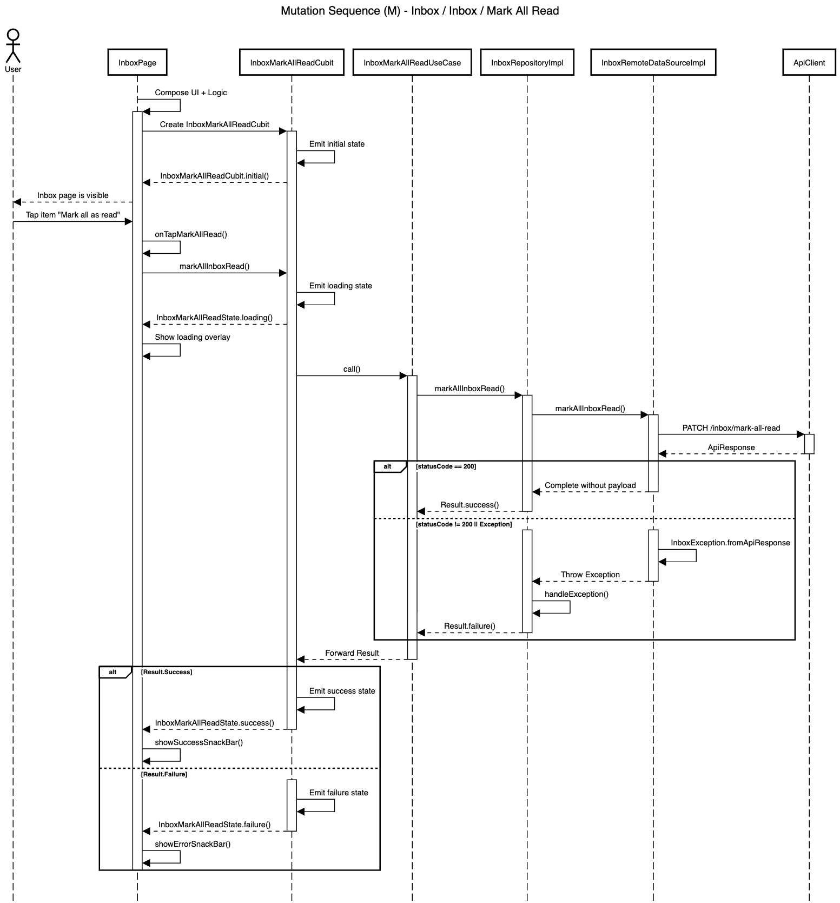

# Mutation Blueprint

| Code | Sequence                      | Module       | Feature     | Feature Slice | Example Method           |
| ---- | ----------------------------- | ------------ | ----------- | ------------- | ------------------------ |
| M    | Mutation                      | inbox        | inbox       | mark_all_read | markAllInboxRead()       |




## **Layer: Data**

### **Datasources**

_modules/inbox/lib/src/features/inbox/data/datasources/inbox_remote_data_source_impl.dart_

```dart
class InboxRemoteDataSourceImpl implements InboxRemoteDataSource {
  final ApiClient _apiClient;

  const InboxRemoteDataSourceImpl({required ApiClient apiClient})
    : _apiClient = apiClient;

  @override
  Future<void> markAllInboxRead() async {
    final response = await _apiClient.patch<Map>('/inboxes/mark-all-read');
    if (response.statusCode == 200) {
      return;
    }
    throw InboxException.fromApiResponse(response);
  }
}
```

&nbsp;

_modules/inbox/lib/src/features/inbox/data/datasources/inbox_remote_data_source.dart_

```dart
abstract interface class InboxRemoteDataSource {
  Future<void> markAllInboxRead();
}
```

&nbsp;

### **Repositories**

_modules/inbox/lib/src/features/inbox/data/repositories/inbox_repository_impl.dart_

```dart
class InboxRepositoryImpl
    with RepositoryExceptionHandler
    implements InboxRepository {
  final InboxRemoteDataSource _remoteDataSource;
  final AppLogger _log;

  const InboxRepositoryImpl({
    required InboxRemoteDataSource inboxRemoteDataSource,
    required AppLogger appLogger,
  }) : _remoteDataSource = inboxRemoteDataSource,
       _log = appLogger;

  @override
  AppLogger get log => _log;

  @override
  AsyncResult<void> markAllInboxRead() async {
    try {
      await _remoteDataSource.markAllInboxRead();
      return const Result.success(null);
    } catch (e, st) {
      return handleException('markAllInboxRead', e, st);
    }
  }
}
```

&nbsp;

## **Layer: Domain**

### **Repositories**

_modules/inbox/lib/src/features/inbox/domain/repositories/inbox_repository.dart_

```dart
abstract interface class InboxRepository {
  AsyncResult<void> markAllInboxRead();
}
```

&nbsp;

### **Usecases**

_modules/inbox/lib/src/features/inbox/domain/usecases/inbox_mark_all_read_use_case.dart_

```dart
class InboxMarkAllReadUseCase extends NoParamUseCase<void> {
  final InboxRepository _repository;

  const InboxMarkAllReadUseCase({required InboxRepository inboxRepository})
    : _repository = inboxRepository;

  @override
  AsyncResult<void> call() => _repository.markAllInboxRead();
}
```

&nbsp;

## **Layer: Logic**

### **Mark_all_read**

_modules/inbox/lib/src/features/inbox/logic/mark_all_read/inbox_mark_all_read_cubit.dart_

```dart
class InboxMarkAllReadCubit extends Cubit<InboxMarkAllReadState> {
  final InboxMarkAllReadUseCase _useCase;

  InboxMarkAllReadCubit({
    required InboxMarkAllReadUseCase inboxMarkAllReadUseCase,
  }) : _useCase = inboxMarkAllReadUseCase,
       super(const InboxMarkAllReadState.initial());

  Future<void> markAllInboxRead() async {
    emit(const InboxMarkAllReadState.loading());

    final result = await _useCase();

    emit(
      result.when(
        success: (_) => const InboxMarkAllReadState.success(),
        failure: (failure) => InboxMarkAllReadState.failure(failure: failure),
      ),
    );
  }
}
```

&nbsp;

_modules/inbox/lib/src/features/inbox/logic/mark_all_read/inbox_mark_all_read_state.dart_

```dart
@freezed
sealed class InboxMarkAllReadState with _$InboxMarkAllReadState {
  const factory InboxMarkAllReadState.initial() = _Initial;
  const factory InboxMarkAllReadState.loading() = _Loading;
  const factory InboxMarkAllReadState.success() = _Success;
  const factory InboxMarkAllReadState.failure({required Failure failure}) =
      _Failure;
}
```

&nbsp;

## **Layer: Ui**

### **Mark_all_read**

_modules/inbox/lib/src/features/inbox/ui/mark_all_read/widgets/inbox_mark_all_read_popup_menu_item.dart_

```dart
class InboxMarkAllReadPopupMenuItem extends PopupMenuItem {
  static const valueKey = 'InboxMarkAllRead';

  const InboxMarkAllReadPopupMenuItem({super.key, super.onTap})
    : super(value: valueKey, child: const _Child());
}

class _Child extends StatelessWidget {
  const _Child();

  @override
  Widget build(BuildContext context) {
    final l10n = context.l10n!;
    return Row(
      children: [
        const Icon(Icons.checklist_rounded, size: 20),
        AppGap.sm,
        Text(l10n.inboxMarkAllReadPopupMenuItem),
      ],
    );
  }
}
```

&nbsp;

## **Barrel Files**

_modules/inbox/lib/src/features/inbox/inbox_feature.dart_

```dart
export '../../templates/blueprints/data/datasources/inbox_remote_data_source.dart';
export '../../templates/blueprints/data/datasources/inbox_remote_data_source_impl.dart';
export '../../templates/blueprints/data/repositories/inbox_repository_impl.dart';

export '../../templates/blueprints/domain/repositories/inbox_repository.dart';
export '../../templates/blueprints/domain/usecases/inbox_mark_all_read_use_case.dart';

export '../../templates/blueprints/logic/mark_all_read/inbox_mark_all_read_cubit.dart';
export '../../templates/blueprints/logic/mark_all_read/inbox_mark_all_read_state.dart';

export '../../templates/blueprints/ui/mark_all_read/widgets/inbox_mark_all_read_popup_menu_item.dart';
```

&nbsp;
